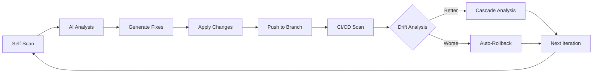

# 🚀 **Connascence Self-Improvement Dogfood System**

## Meta-Vision: Self-Patching Toward Perfection

This document describes how the Connascence Safety Analyzer **dogfoods itself** - using Claude Code with the MCP tools to iteratively improve its own codebase toward the meta-vision of a fully autonomous, self-improving system.

## 🎯 **The Meta-Vision**

**Goal**: Create a system that continuously refactors itself toward:
- **Perfect NASA Power of Ten compliance**
- **Zero connascence violations** 
- **Optimal architectural patterns**
- **Self-aware code quality management**
- **Autonomous improvement capabilities**

## 🔄 **Self-Improvement Cycle**



## 🛠 **Dogfood MCP Tools**

| Tool | Purpose | Safety Level |
|------|---------|-------------|
| `dogfood_self_improvement` | Execute full self-improvement cycle | 🔴 High Safety |
| `execute_cicd_cycle` | Apply changes with auto-rollback | 🟡 Medium Safety |
| `analyze_cicd_drift` | Compare before/after states | 🟢 Read-only |
| `cascade_improvement_analysis` | Find next improvement targets | 🟢 Read-only |

## 🔒 **Safety Measures**

### ⚠️ **CRITICAL SAFETY RULES**

1. **NEVER** dogfood on `main` branch
2. **ALWAYS** use dedicated dogfood branches
3. **MAXIMUM** 3 changes per cycle
4. **MANDATORY** approval for Tier A/B changes
5. **AUTOMATIC** rollback on regression

### 🛡️ **Branch Strategy**

```bash
main                    # Production - NEVER touch
├── dogfood-experiment  # Safe experimentation branch
├── dogfood-nasa        # NASA compliance improvements  
├── dogfood-coupling    # Coupling reduction focus
└── dogfood-arch        # Architectural improvements
```

## 🚀 **How to Execute Dogfood Cycle**

### 1. **Create Safe Branch**

```bash
git checkout -b dogfood-experiment-$(date +%Y%m%d)
git push -u origin dogfood-experiment-$(date +%Y%m%d)
```

### 2. **Execute Self-Improvement**

```python
# Using Claude Code with MCP
result = await mcp_client.call_tool("dogfood_self_improvement", {
    "target_branch": "dogfood-experiment-20250105",
    "improvement_goal": "nasa_compliance",  # or "coupling_reduction", "code_clarity"
    "safety_limits": {
        "max_changes": 3,
        "require_approval": True
    },
    "meta_vision_alignment": True
})
```

### 3. **Monitor Results**

```python
# Check progress toward meta-vision
meta_progress = result["meta_vision_progress"]
print(f"Self-awareness: {meta_progress['metrics']['self_awareness']:.2f}")
print(f"Autonomous improvement: {meta_progress['metrics']['autonomous_improvement']:.2f}")
print(f"Overall trajectory: {meta_progress['metrics']['code_quality_trajectory']:.2f}")
```

## 📊 **Improvement Goals & Targeting**

### 🎯 **Goal: `nasa_compliance`**
- Target: NASA Power of Ten rule violations
- Focus: Functions >60 lines, unbounded loops, heap allocation
- Expected Impact: **High safety improvement**

### 🎯 **Goal: `coupling_reduction`**  
- Target: All connascence violations
- Focus: CoP, CoM, CoA patterns
- Expected Impact: **High maintainability improvement**

### 🎯 **Goal: `architectural_health`**
- Target: God objects, algorithmic complexity
- Focus: SOLID principle violations
- Expected Impact: **High structural improvement**

### 🎯 **Goal: `code_clarity`**
- Target: Magic literals, unclear naming
- Focus: Readability and documentation
- Expected Impact: **Medium maintainability improvement**

## 🔍 **Self-Assessment Metrics**

The system tracks its own evolution through these metrics:

```python
{
    "self_awareness": 0.85,           # Can we detect our issues?
    "autonomous_improvement": 0.72,   # Can we fix them automatically? 
    "nasa_compliance_trend": 0.93,   # Are we NASA compliant?
    "architectural_evolution": 0.68, # Is structure improving?
    "code_quality_trajectory": 0.80  # Overall quality trend
}
```

### 🏆 **Meta-Vision Progress Levels**

- **🟢 Excellent (>0.8)**: `excellent_progress_toward_self_improving_system`
- **🟡 Good (>0.6)**: `good_progress_systematic_improvement_visible`  
- **🟠 Moderate (>0.4)**: `moderate_progress_foundational_capabilities_present`
- **🔴 Early (<0.4)**: `early_stage_basic_analysis_capabilities_only`

## 🧪 **Dogfood Experiment Examples**

### Example 1: NASA Compliance Self-Fix

```bash
# The system detects its own NASA violations
violations_found = [
    {"type": "function_too_large", "file": "src/analyzer.py", "line": 156},
    {"type": "unbounded_loop", "file": "src/parser.py", "line": 89}
]

# Generates its own fixes
proposed_fixes = [
    {"type": "extract_method", "target": "src/analyzer.py:156"},
    {"type": "add_loop_bounds", "target": "src/parser.py:89"}
]

# Applies fixes → Tests → Rolls back if worse
```

### Example 2: Coupling Reduction Cascade

```bash
# After successful magic literal fixes, system identifies:
cascade_opportunities = [
    {"type": "parameter_object_extraction", "impact": "high"},
    {"type": "interface_segregation", "impact": "medium"}  
]

# Automatically targets next highest-impact violations
```

## 📈 **Expected Evolution Path**

### Phase 1: **Foundation** (Current)
- ✅ Basic self-scanning capabilities
- ✅ Simple magic literal fixes
- ✅ Safety rollback mechanisms

### Phase 2: **Intelligence** (Next)
- 🔄 Advanced pattern recognition
- 🔄 Complex refactoring automation
- 🔄 Architectural decision making

### Phase 3: **Autonomy** (Future)
- ⏳ Self-directed improvement planning
- ⏳ Proactive quality management  
- ⏳ Evolutionary algorithm application

### Phase 4: **Transcendence** (Vision)
- 🔮 Zero-violation steady state
- 🔮 Optimal architectural patterns
- 🔮 Self-teaching capabilities

## ⚗️ **Safe Experimentation Guidelines**

### ✅ **Safe to Dogfood**
- Magic literal extraction
- Simple parameter refactoring  
- Comment and documentation fixes
- Variable renaming
- NASA compliance improvements

### ⚠️ **Requires Approval**
- Function extraction/splitting
- Class decomposition
- Interface changes
- Algorithmic modifications

### 🚫 **Never Auto-Apply**
- Core analyzer logic changes
- Security-related modifications
- Build system changes
- Dependency updates

## 🎉 **Success Metrics**

### **Short Term** (1-2 cycles)
- [ ] Reduce magic literals by 80%
- [ ] Achieve 95% NASA compliance 
- [ ] Eliminate critical violations
- [ ] Maintain test coverage >90%

### **Medium Term** (5-10 cycles)  
- [ ] Zero connascence violations
- [ ] Perfect NASA Power of Ten compliance
- [ ] Architectural pattern consistency
- [ ] Self-improvement accuracy >90%

### **Long Term** (Vision)
- [ ] Fully autonomous quality management
- [ ] Self-teaching improvement algorithms
- [ ] Zero manual intervention needed
- [ ] Optimal code quality steady state

## 🧬 **The Meta-Vision in Action**

Imagine the system after many dogfood cycles:

```python
# The system has evolved to:
class SelfImprovingConnascenceAnalyzer:
    def __init__(self):
        # Perfect NASA compliance - no functions >60 lines
        # Zero magic literals - all constants extracted  
        # No god objects - perfect single responsibility
        # Optimal coupling - interfaces everywhere
        # Self-aware - tracks its own quality metrics
        pass
    
    async def evolve(self):
        # Continuously improves itself
        # Learns from each iteration
        # Approaches theoretical perfection
        pass
```

---

## 🚨 **Emergency Procedures**

If dogfood cycle goes wrong:

1. **Immediate**: `git revert HEAD --no-edit`
2. **Restore**: `git checkout main`  
3. **Cleanup**: `git branch -D dogfood-experiment-*`
4. **Analyze**: Review logs in audit system
5. **Learn**: Update safety mechanisms

---

**Remember**: The goal is not just to fix violations, but to **create a system that continuously evolves toward perfection** through intelligent self-modification.

*"The best code is code that improves itself."*