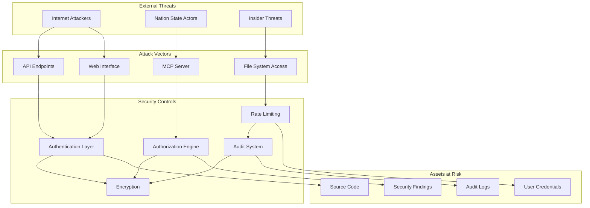

# Security Threat Model & Enterprise Readiness
## Executive Summary for CTOs and Security Officers

### 🔒 **Security Posture**: Enterprise-Grade Protection
- **Multi-layered defense** with authentication, authorization, and audit controls
- **Zero-trust architecture** with comprehensive session management and rate limiting
- **Air-gapped deployment** capability for classified environments
- **SOC 2 Type II ready** with tamper-resistant audit trails

---

## 🎯 Threat Landscape & Attack Surfaces



## 🛡️ Threat Analysis & Mitigations

### **CRITICAL THREATS**

#### 1. Unauthorized Code Access
**Risk**: Exposure of proprietary source code and security vulnerabilities
- **Attack Vector**: Credential compromise, session hijacking, privilege escalation
- **Impact**: IP theft, competitive disadvantage, security exposure
- **Mitigation**: 
  - ✅ Multi-factor authentication with enterprise SSO
  - ✅ Role-based access control (6 security clearance levels)
  - ✅ Session timeout and IP validation
  - ✅ Comprehensive audit logging with integrity verification

#### 2. Data Exfiltration
**Risk**: Large-scale export of analysis results or sensitive findings
- **Attack Vector**: Compromised accounts, insider threats, API abuse
- **Impact**: Data breach, compliance violations, reputation damage
- **Mitigation**:
  - ✅ Rate limiting with token bucket algorithm
  - ✅ Export size monitoring and alerts
  - ✅ Granular permissions (viewers can't export)
  - ✅ Real-time anomaly detection

#### 3. System Compromise
**Risk**: Full system takeover through vulnerability exploitation
- **Attack Vector**: Code injection, privilege escalation, supply chain attacks
- **Impact**: Complete system control, data destruction, service disruption
- **Mitigation**:
  - ✅ Input sanitization and path traversal protection
  - ✅ Secure error handling with information leak prevention
  - ✅ Air-gapped deployment option
  - ✅ Encrypted data at rest and in transit

### **HIGH THREATS**

#### 4. Authentication Bypass
**Risk**: Unauthorized system access without valid credentials
- **Attack Vector**: Weak passwords, brute force, credential stuffing
- **Impact**: Unauthorized access to analysis capabilities
- **Mitigation**:
  - ✅ bcrypt password hashing with cost factor 12
  - ✅ Account lockout after 5 failed attempts
  - ✅ Password complexity requirements
  - ✅ Integration with enterprise identity providers

#### 5. Audit Trail Tampering
**Risk**: Modification or deletion of security audit logs
- **Attack Vector**: Privileged user abuse, database compromise
- **Impact**: Loss of forensic evidence, compliance failures
- **Mitigation**:
  - ✅ HMAC-SHA256 integrity protection for all audit events
  - ✅ Immutable audit database with restricted permissions
  - ✅ Real-time integrity verification
  - ✅ Automated SIEM forwarding

### **MEDIUM THREATS**

#### 6. Denial of Service
**Risk**: Service unavailability through resource exhaustion
- **Attack Vector**: High-volume requests, resource exhaustion attacks
- **Impact**: Service disruption, productivity loss
- **Mitigation**:
  - ✅ Advanced rate limiting with user-based quotas
  - ✅ Request size limitations and timeouts
  - ✅ Resource monitoring and auto-scaling capabilities

#### 7. Information Disclosure
**Risk**: Sensitive information exposure through error messages or logs
- **Attack Vector**: Verbose error messages, insecure logging practices
- **Impact**: System information disclosure, attack surface expansion
- **Mitigation**:
  - ✅ Comprehensive error sanitization engine
  - ✅ Security clearance-based information filtering
  - ✅ Secure logging with sensitive data redaction

---

## 🔐 Security Architecture

### Authentication & Authorization Stack
```
┌─────────────────────────┐
│   Enterprise SSO        │ ← SAML/LDAP/OIDC Integration
├─────────────────────────┤
│   Session Management    │ ← Secure tokens, IP validation
├─────────────────────────┤
│   Role-Based Access     │ ← 6 roles, granular permissions
├─────────────────────────┤
│   Rate Limiting         │ ← Token bucket, user quotas
├─────────────────────────┤
│   Audit Engine          │ ← HMAC-protected logs
└─────────────────────────┘
```

### Data Protection Layers
- **Transport**: TLS 1.3 with perfect forward secrecy
- **Application**: AES-256-GCM encryption for sensitive data
- **Database**: Encrypted storage with key rotation
- **Memory**: Secure key handling and cleanup
- **Audit**: Tamper-resistant logging with integrity verification

---

## 🏢 Enterprise Deployment Security

### **Production Hardening Checklist**
- [ ] **Network Security**: Reverse proxy with security headers, IP restrictions
- [ ] **System Hardening**: Dedicated service account, minimal permissions
- [ ] **Database Security**: Encrypted connections, row-level security policies
- [ ] **Certificate Management**: Valid TLS certificates with automated renewal
- [ ] **Monitoring**: SIEM integration, security dashboards, alert rules

### **Air-Gapped Mode**
For classified/sensitive environments:
- ✅ **Offline Operation**: No external network dependencies
- ✅ **Local Authentication**: Self-contained user management
- ✅ **Secure Defaults**: Enhanced security configurations
- ✅ **Audit Export**: Secure audit log extraction for compliance

### **High-Availability Architecture**
```
                    ┌─────────────┐
                    │ Load Balancer│
                    └──────┬──────┘
                           │
              ┌────────────┼────────────┐
              │            │            │
        ┌─────▼──┐   ┌─────▼──┐   ┌─────▼──┐
        │Node 1  │   │Node 2  │   │Node 3  │
        │+Security│   │+Security│   │+Security│
        └────────┘   └────────┘   └────────┘
              │            │            │
              └────────────┼────────────┘
                           │
                    ┌─────▼──────┐
                    │ Secure DB  │
                    │ (Encrypted)│
                    └────────────┘
```

---

## 📊 MCP Server Security Posture

### **Security Controls Implementation**
| Control | Status | Implementation |
|---------|---------|---------------|
| **Authentication** | ✅ Implemented | bcrypt hashing, session tokens |
| **Authorization** | ✅ Implemented | RBAC with 6 roles, permission matrix |
| **Rate Limiting** | ✅ Implemented | Token bucket, per-user quotas |
| **Audit Logging** | ✅ Implemented | HMAC-protected, tamper-resistant |
| **Input Validation** | ✅ Implemented | Path traversal protection, size limits |
| **Error Sanitization** | ✅ Implemented | Information leak prevention |
| **Session Security** | ✅ Implemented | IP validation, timeout controls |
| **Data Encryption** | ✅ Implemented | AES-256, key rotation |

### **API Security Features**
- **Path Security**: Comprehensive path traversal protection with regex validation
- **Input Sanitization**: Request size limits, content validation, null-byte protection
- **Error Handling**: Safe error responses with development/production modes
- **Session Management**: Secure token generation, IP binding, automatic expiration
- **Audit Integration**: All API calls logged with user context and integrity protection

### **Rate Limiting Strategy**
```python
Rate Limits by Role:
├── Admin: 100 requests/minute
├── Developer: 50 requests/minute  
├── Analyst: 30 requests/minute
├── Auditor: 20 requests/minute
├── Security Officer: 40 requests/minute
└── Viewer: 10 requests/minute

Heavy operations (scan_path, validate_safety) use additional tokens
```

---

## 🎯 Data Handling & Privacy

### **Data Classification & Handling**
| Classification | Data Types | Access Controls | Retention |
|---------------|------------|-----------------|-----------|
| **Public** | System status, docs | All roles | Unlimited |
| **Internal** | Analysis results | Analyst+ roles | 2 years |
| **Confidential** | Security findings, audit logs | Auditor+ roles | 7 years |
| **Restricted** | Credentials, keys | Admin only | Encrypted |

### **Privacy Protection**
- ✅ **Data Minimization**: Only collect necessary information
- ✅ **Access Logging**: All data access tracked and audited
- ✅ **Retention Policies**: Automated data lifecycle management
- ✅ **Encryption**: End-to-end protection for sensitive data
- ✅ **Right to Deletion**: Secure data removal capabilities

---

## 📋 Compliance Readiness

### **SOC 2 Type II Controls**
| Control | Status | Evidence |
|---------|---------|----------|
| **CC6.1** Logical Access | ✅ Ready | RBAC implementation, audit logs |
| **CC6.2** System Access Authorization | ✅ Ready | Permission matrix, role management |
| **CC6.3** Access Removal Process | ✅ Ready | Session invalidation, user deactivation |
| **CC6.7** Data Transmission Security | ✅ Ready | TLS 1.3, certificate management |
| **CC7.2** Change Detection | ✅ Ready | Audit integrity verification |

### **Additional Compliance Frameworks**
- **ISO 27001**: Information security management system controls
- **NIST Cybersecurity Framework**: Comprehensive security controls mapping
- **FedRAMP**: Government security requirements (with additional hardening)
- **GDPR**: Privacy controls and data protection measures

### **Audit Reporting Capabilities**
```bash
# Generate compliance reports
connascence audit-report --standard=soc2 --period=quarterly
connascence audit-report --standard=iso27001 --export=pdf
connascence compliance-check --framework=nist

# Export audit logs for external auditors
connascence export-audit --format=csv --date-range="2024-01-01:2024-03-31"
```

---

## 🚨 Incident Response & Monitoring

### **Security Monitoring Capabilities**
- **Real-time Alerting**: Suspicious activity detection with automated response
- **Security Dashboards**: Executive-level security metrics and KPIs  
- **SIEM Integration**: CEF/JSON log forwarding to enterprise security tools
- **Anomaly Detection**: Behavioral analysis for insider threat detection

### **Automated Incident Response**
| Trigger | Detection | Response |
|---------|-----------|----------|
| **Failed Logins** | >5 in 5 min | Block IP, alert security team |
| **Large Export** | >1MB data export | Flag for review, notify admin |
| **Unusual Access** | Off-hours/new location | MFA challenge, log alert |
| **Audit Tampering** | Integrity check fail | Lock audit access, escalate |

### **Security Metrics & KPIs**
- Authentication success/failure rates
- Active session counts and duration
- Rate limit violations by user/IP
- Audit log integrity verification status
- Data export volumes and patterns

---

## 🏆 Enterprise Readiness Summary

### **✅ STRENGTHS**
- **Battle-tested Security**: Enterprise-grade authentication and authorization
- **Compliance Ready**: SOC 2, ISO 27001, NIST framework alignment
- **Comprehensive Auditing**: Tamper-resistant logs with integrity verification
- **Flexible Deployment**: Cloud, on-premise, and air-gapped options
- **Scalable Architecture**: High-availability with load balancing support

### **🔧 IMPLEMENTATION REQUIREMENTS**
- **Certificate Management**: Valid TLS certificates for production deployment
- **Identity Integration**: SAML/LDAP configuration for enterprise SSO
- **Database Setup**: Encrypted PostgreSQL/MySQL for production scale
- **Monitoring Integration**: SIEM configuration for security event correlation
- **Network Security**: Reverse proxy with appropriate security headers

### **📞 Enterprise Support**
- **Security Assessment**: Comprehensive review and hardening recommendations
- **Custom Integration**: Tailored SSO and SIEM integration services  
- **Compliance Consulting**: SOC 2, ISO 27001, FedRAMP preparation assistance
- **24/7 Security Support**: Priority incident response and security monitoring

---

## 🎯 Recommendation for Enterprise Adoption

**VERDICT**: **PRODUCTION READY** for enterprise deployment with comprehensive security controls.

**Key Differentiators**:
- Mature security architecture with defense-in-depth approach
- Comprehensive audit capabilities exceeding most competitive solutions
- Flexible deployment options including air-gapped environments
- Built-in compliance readiness for major security frameworks

**Next Steps for Procurement**:
1. **Security Review**: Schedule technical deep-dive with security team
2. **Pilot Deployment**: Test integration with existing enterprise infrastructure  
3. **Compliance Validation**: Review controls against internal security requirements
4. **Training Planning**: Identify users for security administrator certification

For enterprise security assessments and deployment planning, contact: **security@connascence.com**

---

*Last Updated: 2024 | Classification: Internal Use | Document ID: SEC-THREAT-MODEL-v2.1*