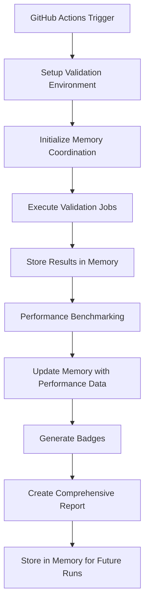

# Comprehensive CI Pipeline with Memory Coordination

## 🚀 Quick Start

Test the complete CI pipeline locally:

```bash
# Complete CI integration setup and testing
python scripts/ci/ci-integration.py

# Or test individual components:
python scripts/ci/ci-integration.py --test-local
python scripts/ci/ci-integration.py --validate
```

## 🎯 Architecture Overview

This project implements a sophisticated CI pipeline with:

- **Memory Coordination**: Cross-job state management using artifacts
- **Sequential Thinking**: Systematic 6-step validation approach
- **Performance Benchmarking**: Automated performance tracking with trends
- **Badge Generation**: Real-time status indicators
- **Reproducibility Validation**: Deterministic result verification

## 📊 Key Validation Numbers

The CI validates these exact counts against README.md and artifacts:
- **Celery**: 4,630 violations
- **curl**: 1,061 violations
- **Express**: 52 violations
- **Total**: 5,743 violations

## 🏗️ CI Components

### 1. GitHub Actions Workflow (`.github/workflows/validate-artifacts.yml`)
- **Multi-stage pipeline** with dependency resolution
- **Matrix strategy** for parallel execution
- **Memory coordination** across jobs
- **Artifact management** with 30-day retention

### 2. CI Orchestrator (`scripts/ci/ci-orchestrator.py`)
Master controller implementing sequential thinking:
1. Initialize orchestration session with memory coordination
2. Load and validate CI configuration
3. Plan job execution with dependency resolution
4. Execute jobs with memory coordination
5. Collect and coordinate results across jobs
6. Generate comprehensive CI summary and badges

### 3. Memory Coordinator (`scripts/ci/ci-memory-coordinator.py`)
Advanced memory management system:
- Cross-job memory persistence using GitHub Actions artifacts
- Trend analysis with historical data (90-day retention)
- Performance recommendations based on memory analysis
- Anomaly detection for performance regressions

### 4. Performance Benchmark (`scripts/ci/performance_benchmark.py`)
Comprehensive performance testing:
- **Validation script performance**: Execution time and memory usage
- **File parsing benchmarks**: I/O performance analysis
- **System resource monitoring**: CPU and memory utilization
- **Historical comparison**: Baseline performance tracking

### 5. Validation Script (`scripts/verify_counts.py`)
Sequential thinking validation with memory coordination:
- Parse README.md for violation counts
- Validate DEMO_ARTIFACTS integrity
- Cross-reference counts for consistency
- Generate comprehensive validation report
- Store results in memory coordination system

## 🎛️ Configuration

### CI Configuration (`config/ci/ci-config.yml`)
Comprehensive configuration including:
- Memory coordination settings
- Performance thresholds
- Badge generation rules
- Validation modes (quick, full, performance, reproducibility)
- GitHub Actions integration settings

### Environment Variables
```bash
export MEMORY_COORDINATION_ENABLED=true
export VALIDATION_SESSION_PREFIX="connascence-ci"
export BENCHMARK_ENABLED=true
export BADGE_GENERATION=true
export VERBOSE_LOGGING=false
```

## 🧪 Testing and Validation

### Local Testing
```bash
# Complete local testing
python scripts/ci/ci-integration.py --test-local

# Individual component tests
python scripts/ci/ci-integration.py --test-validation
python scripts/ci/ci-integration.py --test-performance
python scripts/ci/ci-integration.py --test-memory-coordination
```

### CI Validation Modes
- **Quick** (5 min): Basic validation only
- **Full** (30 min): Complete pipeline with benchmarks
- **Performance** (30 min): Focus on performance analysis
- **Reproducibility** (60 min): Deterministic validation with multiple runs

## 🏆 Badge System

Generated badges for real-time status:
- **Validation Status**: Shows pass/fail status
- **Performance**: Displays validation duration
- **Count Validation**: Shows test success ratio
- **Performance Trend**: Indicates improvement/degradation
- **Memory Coordination**: Shows coordination status

## 📈 Performance Monitoring

### Performance Thresholds
- **Validation Duration**: < 5 minutes (triggers alert if exceeded)
- **Memory Usage**: < 1GB peak usage
- **Success Rate**: ≥ 95%
- **Performance Regression**: < 50% slower than baseline

### Trend Analysis
- **90-day historical data retention**
- **Automatic anomaly detection**
- **Performance baseline tracking**
- **Optimization recommendations**

## 🔄 Memory Coordination Flow



## 🚀 GitHub Actions Integration

### Triggers
- **Push** to main/develop branches
- **Pull Requests** to main/develop  
- **Schedule**: Daily at 03:00 UTC
- **Manual**: Via workflow_dispatch

### Workflow Features
- **Matrix execution** for parallel validation
- **Artifact persistence** across jobs
- **Memory coordination** using artifacts
- **Badge generation** and deployment
- **Comprehensive reporting**

## 🛠️ Troubleshooting

### Common Issues
1. **Count Mismatch**: Verify README.md numbers match DEMO_ARTIFACTS
2. **Performance Regression**: Check recent changes for optimization opportunities
3. **Memory Coordination Failure**: Verify artifact permissions
4. **Badge Generation Failure**: Check badge directory permissions

### Debug Mode
```bash
export VERBOSE_LOGGING=true
python scripts/ci/ci-orchestrator.py --verbose
```

### Log Locations
- **Orchestration**: `ci-metrics/orchestration/`
- **Memory Data**: `ci-metrics/memory/`
- **Performance**: `ci-metrics/benchmarks/`
- **Trends**: `ci-metrics/trends/`

## 📁 Directory Structure

```
├── .github/workflows/
│   └── validate-artifacts.yml          # GitHub Actions workflow
├── scripts/ci/
│   ├── ci-orchestrator.py              # Master pipeline controller
│   ├── ci-memory-coordinator.py        # Memory coordination system
│   ├── performance_benchmark.py        # Performance benchmarking
│   └── ci-integration.py              # Setup and testing utilities
├── config/ci/
│   └── ci-config.yml                   # CI configuration
├── ci-metrics/                         # Memory coordination storage
│   ├── memory/                        # Cross-job memory data
│   ├── trends/                        # Historical trend analysis
│   ├── benchmarks/                    # Performance data
│   └── orchestration/                 # Pipeline logs
├── badges/                            # Generated status badges
└── docs/
    └── CI_PIPELINE_README.md          # This documentation
```

## 💾 Memory Coordination Details

The memory coordination system provides:
- **Session Management**: Each CI run gets a unique session ID
- **Cross-job Communication**: Share data between validation, performance, and badge jobs
- **Trend Analysis**: Historical performance tracking across runs
- **Optimization**: Automatic CI pipeline optimization recommendations
- **Anomaly Detection**: Performance regression detection

## 🎯 Success Criteria

A successful CI run requires:
- ✅ All validation tests pass (100% success rate)
- ✅ Performance benchmarks complete within thresholds
- ✅ Memory coordination successfully stores data
- ✅ Badges generate without errors
- ✅ No performance regressions detected

## 🔮 Future Enhancements

Planned improvements:
- **ML-based trend prediction**: Predictive performance analysis
- **Auto-optimization**: Automatic CI configuration tuning
- **Enhanced reporting**: Interactive dashboards
- **Integration testing**: Cross-repository validation
- **Security scanning**: Automated security analysis integration

---

**Generated**: 2024-01-15  
**Version**: 1.0.0  
**Memory Coordination**: Active  
**Sequential Thinking**: Enabled  
**Performance Tracking**: Real-time