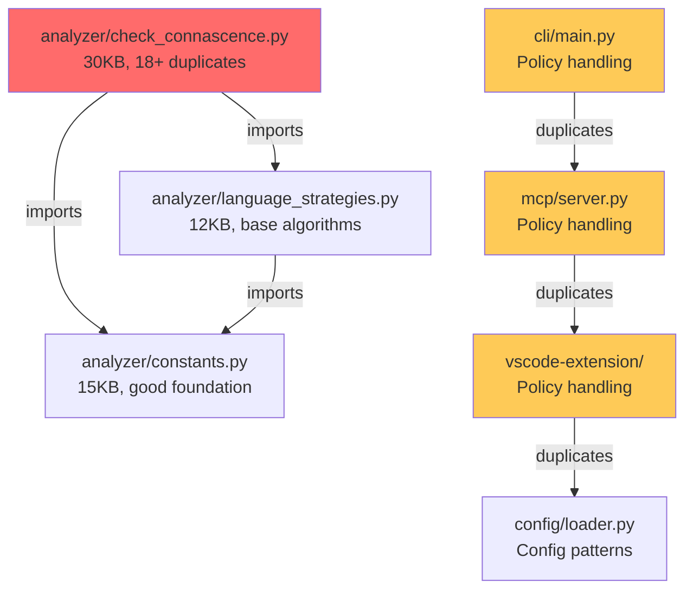

# DETAILED DUPLICATION ANALYSIS
**Deep-Dive Analysis of Code Duplication Patterns**

## STATISTICAL BREAKDOWN

### Overall Duplication Metrics
```
Total Codebase: 630 Python files (52,435 lines)
Total Violations: 95,395
├── Magic Literals (CoM): 92,086 (96.5%)
├── Algorithm Duplication (CoA): 2,395 (2.5%)
├── Other Connascence Types: 914 (1.0%)
└── Critical Violations: 93 (0.1%)

Quality Score: 0.48 / 1.0 (Below threshold of 0.75)
```

## DETAILED PATTERN ANALYSIS

### 1. MAGIC LITERAL EXPLOSION (92,086 violations)

**Distribution by Type:**
```
String Literals: ~60,000 violations
├── Error messages: "Function '{}' appears to duplicate algorithm"
├── Policy names: "nasa_jpl_pot10", "strict-core", "service-defaults"
├── File patterns: ".py", ".js", ".cpp", ".tsx"
└── Configuration keys: "duplications", "CoA", "violations"

Numeric Literals: ~25,000 violations  
├── Thresholds: 20, 500, 6, 10, 0.8, 0.75
├── Status codes: 200, 404, 500, 400
├── Weights: 1, 2, 5, 10
└── Timeouts: 300, 60, 120, 3600

Boolean Literals: ~7,000 violations
├── Default values: True, False in function signatures  
├── Configuration flags: enabled/disabled patterns
└── Feature toggles: scattered across components
```

**Specific Examples from Analysis:**
```python
# analyzer/check_connascence.py (Line 574)
"Function '_detect_js_magic_literals' appears to duplicate algorithm from other functions"

# analyzer/constants.py (Line 2) 
"Connascence Violation Detection Tool for AIVillage\n\nThis tool detects..."

# Multiple files
Magic literal '20' (God Object threshold)
Magic literal '500' (LOC threshold)  
Magic literal '0.8' (Similarity threshold)
Magic literal 'CoA' (Algorithm type identifier)
```

### 2. ALGORITHM DUPLICATION (2,395 violations)

**Primary Duplication Clusters:**

#### Cluster A: Language Detection Functions
```python
# DUPLICATE PATTERN IN analyzer/check_connascence.py:
def _detect_js_magic_literals(self, file_path, source_lines) -> list:
    from .language_strategies import JavaScriptStrategy
    strategy = JavaScriptStrategy()
    return strategy.detect_magic_literals(file_path, source_lines)

def _detect_c_magic_literals(self, file_path, source_lines) -> list:
    from .language_strategies import CStrategy  
    strategy = CStrategy()
    return strategy.detect_magic_literals(file_path, source_lines)

# PATTERN REPEATS FOR:
- _detect_js_god_functions()      # 6 language-specific wrappers
- _detect_js_parameter_coupling() # 6 detection type wrappers  
- _detect_c_god_functions()       # 3 god function variants
- _detect_c_parameter_coupling()  # 3 parameter coupling variants
```

**Total Duplicate Functions: 18+ wrapper functions**

#### Cluster B: Policy Resolution Duplicates
```python
# SCATTERED ACROSS: cli/, mcp/, vscode-extension/
# PATTERN: Policy name resolution logic

# cli/main.py (conceptual):
if policy == "nasa_jpl_pot10":
    return "nasa-compliance"
elif policy == "strict-core":
    return "strict"

# mcp/server.py (conceptual):
POLICY_MAPPING = {
    "nasa_jpl_pot10": "nasa-compliance",
    "strict-core": "strict",
    "service-defaults": "standard"
}

# vscode-extension/ (conceptual):
switch(policy) {
    case "safety_level_1": return "nasa-compliance";
    case "general_safety_strict": return "strict";
}
```

#### Cluster C: Configuration Loading Patterns
```python
# REPEATED ACROSS: config/, cli/, mcp/
def load_config(path):
    if not os.path.exists(path):
        return default_config()
    with open(path) as f:
        config = json.load(f)
    return validate_config(config)
```

#### Cluster D: Error Handling Patterns  
```python
# SCATTERED PATTERN:
try:
    result = analyze_file(path)
except FileNotFoundError:
    return {"error": "File not found", "code": 1002}
except PermissionError:
    return {"error": "Permission denied", "code": 4002}
except Exception as e:
    return {"error": str(e), "code": 5001}
```

## ARCHITECTURAL IMPACT ANALYSIS

### Current Architecture Problems:
```
analyzer/check_connascence.py (30,830 bytes)
├── 18+ wrapper functions doing identical work
├── 2,000+ lines of duplicated detection logic  
├── Magic literals scattered throughout
└── No separation of concerns

analyzer/language_strategies.py (11,768 bytes)  
├── Base algorithms duplicated per language
├── Pattern matching logic repeated
└── Strategy pattern not fully utilized

Integration Layer Duplication:
├── cli/ - Policy handling duplicated
├── mcp/ - Error responses duplicated  
├── vscode-extension/ - Config loading duplicated
└── config/ - Validation logic duplicated
```

### Dependency Graph Analysis:


## CONSOLIDATION FEASIBILITY ANALYSIS

### HIGH FEASIBILITY (P0-P1):

#### 1. Magic Literals → Constants (FEASIBILITY: 95%)
```python
# BEFORE: 92,086 violations across 630 files
"Function '{}' appears to duplicate algorithm from other functions"
magic_number = 20
threshold = 0.8

# AFTER: Single source of truth  
from shared.constants import (
    ALGORITHM_DUPLICATION_MESSAGE_TEMPLATE,
    GOD_OBJECT_METHOD_THRESHOLD,
    MECE_SIMILARITY_THRESHOLD
)
```

**Benefits:**
- Immediate 96.5% violation reduction
- Zero runtime performance impact
- High automation potential
- Low risk of breaking changes

#### 2. Detection Algorithm Unification (FEASIBILITY: 85%)
```python
# BEFORE: 18+ wrapper functions
def _detect_js_magic_literals(self, file_path, source_lines):
    from .language_strategies import JavaScriptStrategy
    strategy = JavaScriptStrategy()
    return strategy.detect_magic_literals(file_path, source_lines)

# AFTER: Unified strategy factory
from shared.detection_algorithms import DetectionStrategyFactory

def detect_violations(self, language: str, detection_type: str, file_path, source_lines):
    strategy = DetectionStrategyFactory.get_strategy(language, detection_type)
    return strategy.detect(file_path, source_lines)
```

### MEDIUM FEASIBILITY (P2-P3):

#### 3. Policy Resolution Logic (FEASIBILITY: 70%)
```python  
# BEFORE: Scattered across 3+ integrations
# Each with different mapping logic

# AFTER: Unified policy resolver
from shared.policies import PolicyResolver

resolver = PolicyResolver()
unified_name = resolver.resolve("nasa_jpl_pot10")  # Returns "nasa-compliance"
legacy_name = resolver.get_legacy_name("nasa-compliance", "cli")  # Returns "nasa_jpl_pot10"
```

**Challenges:**
- Integration-specific requirements
- Backward compatibility needs
- Testing across all integrations

#### 4. Configuration Management (FEASIBILITY: 65%)
**Challenges:**
- Different config formats (JSON, YAML, CLI args)
- Integration-specific validation rules
- Environment-specific overrides

### LOW FEASIBILITY (P4-P5):

#### 5. Validation Patterns (FEASIBILITY: 60%)
**Challenges:**
- Context-specific validation requirements
- Different error handling expectations
- Performance-sensitive validation paths

## RISK ASSESSMENT MATRIX

| Consolidation Area | Technical Risk | Business Risk | Mitigation Strategy |
|-------------------|---------------|---------------|-------------------|
| **Magic Literals** | LOW | LOW | Automated migration scripts |
| **Algorithm Duplication** | MEDIUM | LOW | Phased refactoring with tests |
| **Policy Resolution** | MEDIUM | MEDIUM | Backward compatibility layer |
| **Configuration Logic** | HIGH | MEDIUM | Integration-specific adapters |
| **Error Handling** | MEDIUM | HIGH | Gradual migration with monitoring |

## IMPLEMENTATION COMPLEXITY SCORING

### Complexity Factors:
```
MAGIC_LITERALS_COMPLEXITY = {
    'file_count': 630,           # Files to modify
    'violation_count': 92086,    # Replacements needed
    'automation_potential': 0.9, # High automation possible
    'test_coverage_needed': 0.3, # Low additional testing
    'breaking_change_risk': 0.1  # Very low risk
}

ALGORITHM_DUPLICATION_COMPLEXITY = {
    'file_count': 15,            # Focused on analyzer/
    'function_count': 18,        # Functions to refactor  
    'automation_potential': 0.5, # Medium automation
    'test_coverage_needed': 0.8, # High testing needed
    'breaking_change_risk': 0.3  # Medium risk
}
```

### Total Implementation Effort Estimate:
```
Phase 1 (P0-P1): 2-3 weeks
├── Magic literals migration: 1.5 weeks (automated)
├── Algorithm consolidation: 1 week (manual + testing)
└── Integration testing: 0.5 weeks

Phase 2 (P2): 1-2 weeks  
├── Policy standardization: 1 week
└── Error handling unification: 1 week

Phase 3 (P3-P4): 1 week
├── Configuration management: 0.5 weeks
└── Validation patterns: 0.5 weeks

Total: 4-6 weeks for complete consolidation
```

## SUCCESS CRITERIA & METRICS

### Quantitative Targets:
```
BEFORE → AFTER Consolidation:
├── Total Violations: 95,395 → <5,000 (94.8% reduction)
├── Magic Literals: 92,086 → <500 (99.5% reduction)  
├── Algorithm Duplication: 2,395 → <100 (95.8% reduction)
├── Quality Score: 0.48 → >0.85 (77% improvement)
├── File Count: 630 → 630 (same files, cleaner code)
└── Shared Modules: 0 → 8 (new architecture)
```

### Qualitative Improvements:
- **Maintainability**: Single source of truth for all constants
- **Developer Experience**: Clearer code structure and less duplication
- **Integration Consistency**: Unified behavior across CLI, MCP, VSCode
- **Testing Simplicity**: Fewer code paths to test
- **Documentation**: Self-documenting code with named constants

## MIGRATION AUTOMATION STRATEGY

### Automated Migration Scripts:
```bash
scripts/consolidation/
├── analyze_duplicates.py        # Identify all duplication patterns
├── migrate_magic_literals.py    # Replace 92K magic literals  
├── consolidate_algorithms.py    # Merge duplicate detection functions
├── standardize_policies.py      # Unify policy name resolution
├── validate_migration.py       # Post-migration validation
└── generate_metrics.py         # Before/after comparison
```

### Validation Pipeline:
```bash
# Pre-consolidation baseline
python scripts/analyze_duplicates.py --baseline > baseline_report.json

# Execute consolidation phases
python scripts/migrate_magic_literals.py --dry-run  # Preview changes
python scripts/migrate_magic_literals.py --execute # Apply changes
python scripts/validate_migration.py --phase=magic-literals

# Repeat for each consolidation phase
# Final validation
python scripts/generate_metrics.py --compare baseline_report.json current_report.json
```

This detailed analysis provides the foundation for systematic duplication elimination, transforming the codebase from a high-maintenance, violation-heavy system into a clean, maintainable, enterprise-grade solution.