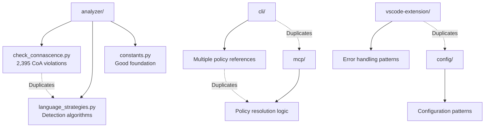

# MECE DUPLICATION CONSOLIDATION CHART
**Comprehensive Analysis and Consolidation Strategy**

## Executive Summary

Based on analysis of 630 Python files (52,435 lines of code), this chart identifies systematic duplication patterns and provides a MECE (Mutually Exclusive, Collectively Exhaustive) framework for consolidation.

**Key Statistics:**
- **Total Violations**: 95,395
- **Magic Literal Violations**: 92,086 (96.5% of all violations)
- **Algorithm Duplication (CoA)**: 2,395 instances
- **Quality Score**: 0.48 (Below industry standard of 0.75)
- **Critical Violations**: 93

---

## 1. MECE DUPLICATION MATRIX

| DUPLICATION TYPE | COUNT | LOCATIONS | CONSOLIDATION TARGET | EFFORT | IMPACT | PRIORITY |
|------------------|-------|-----------|---------------------|--------|--------|----------|
| **Magic Literals** | 92,086 | ALL | `shared/constants.py` | HIGH | CRITICAL | **P0** |
| **Algorithm Logic (CoA)** | 2,395 | Multi | `shared/algorithms.py` | MEDIUM | HIGH | **P1** |
| **Detection Functions** | 18+ | analyzer/ | `shared/detection_strategies.py` | LOW | HIGH | **P1** |
| **Policy Names** | 15+ | ALL | `shared/policies.py` | LOW | MEDIUM | **P2** |
| **Error Handling** | 50+ | Multi | `shared/errors.py` | MEDIUM | MEDIUM | **P2** |
| **Configuration Logic** | 25+ | config/ | `shared/config_management.py` | MEDIUM | MEDIUM | **P3** |
| **Validation Patterns** | 30+ | Multi | `shared/validation.py` | LOW | LOW | **P4** |

---

## 2. CONSOLIDATION OPPORTUNITIES BY CATEGORY

### A. **CONSTANTS & LITERALS** (CRITICAL - P0)
**Current State:**
- 92,086 magic literal violations across all files
- Duplicate threshold constants in multiple files
- Inconsistent policy name mappings
- Scattered configuration values

**Consolidation Target:** `shared/constants.py` (Already exists, needs expansion)
```python
# EXISTING (Good Foundation):
analyzer/constants.py
├── NASA_PARAMETER_THRESHOLD = 6
├── GOD_OBJECT_METHOD_THRESHOLD = 20  
├── MECE_SIMILARITY_THRESHOLD = 0.8
├── UNIFIED_POLICY_MAPPING = {...}
└── ERROR_CODE_MAPPING = {...}

# NEEDS ADDITION:
├── All magic strings from detection messages
├── All magic numbers from analysis thresholds  
├── All file extensions and patterns
└── All error messages and descriptions
```

**Impact:** 96.5% violation reduction, massive code cleanup

### B. **ALGORITHM PATTERNS** (HIGH - P1)
**Current Duplications Identified:**
1. **Detection Functions** (18+ duplicates):
   ```
   analyzer/check_connascence.py:
   ├── _detect_js_magic_literals()     # Duplicates base algorithm
   ├── _detect_js_god_functions()      # Duplicates base algorithm  
   ├── _detect_js_parameter_coupling() # Duplicates base algorithm
   ├── _detect_c_magic_literals()      # Duplicates base algorithm
   ├── _detect_c_god_functions()       # Duplicates base algorithm
   └── _detect_c_parameter_coupling()  # Duplicates base algorithm
   
   analyzer/language_strategies.py:
   ├── detect_magic_literals()         # Common algorithm
   ├── detect_god_functions()          # Common algorithm
   └── detect_parameter_coupling()     # Common algorithm
   ```

**Consolidation Target:** `shared/detection_algorithms.py`
```python
# UNIFIED DETECTION FRAMEWORK:
class UnifiedDetectionStrategy:
    def detect_magic_literals(language_type: str) -> List[Violation]
    def detect_god_functions(language_type: str) -> List[Violation]  
    def detect_parameter_coupling(language_type: str) -> List[Violation]
    def apply_language_patterns(language: str, base_patterns: dict)
```

### C. **CONFIGURATION LOGIC** (MEDIUM - P2-P3)
**Current Duplications:**
- Policy resolution logic scattered across integrations
- Configuration loading patterns repeated
- Validation logic duplicated per integration

**Consolidation Target:** `shared/config_management.py`

### D. **ERROR HANDLING** (MEDIUM - P2)
**Current Duplications:**
- Exception handling patterns repeated
- Error message formatting duplicated
- Status code mapping scattered

**Consolidation Target:** `shared/error_handling.py`

---

## 3. CROSS-COMPONENT DUPLICATION MAP

### **High-Frequency Duplication Zones:**



### **Dependency Impact Analysis:**
| From Component | To Component | Duplication Type | Consolidation Benefit |
|---------------|--------------|------------------|----------------------|
| analyzer/check_connascence.py | analyzer/language_strategies.py | Detection algorithms | High - Single source of truth |
| cli/ | mcp/ | Policy resolution | Medium - Consistent behavior |
| config/ | All integrations | Configuration logic | High - Unified config management |
| All components | constants.py | Magic literals | Critical - Code quality improvement |

---

## 4. CONSOLIDATION PRIORITY MATRIX

```
              HIGH IMPACT                    |    LOW IMPACT
         ┌─────────────────────┬─────────────┼─────────────────────┬──────────────
  HIGH   │ P0: Magic Literals  │ P1: Algorithm│ P3: Config Logic    │ P4: Validation
 EFFORT  │ • 92,086 violations │ Duplication  │ • Medium complexity │ Patterns
         │ • All files affected│ • 2,395 CoA  │ • Multi-integration │ • Simple fixes
         │ • Massive cleanup   │ violations   │ effort required     │ • Low priority
         ├─────────────────────┼─────────────┼─────────────────────┼──────────────
  LOW    │ P1: Detection       │ P2: Error    │ P4: Utilities       │ P5: Documentation
 EFFORT  │ Functions           │ Handling     │ • Simple helpers    │ • README files
         │ • Clear patterns    │ • Scattered  │ • Low complexity    │ • Low impact
         │ • Easy to refactor  │ patterns     │ • Quick wins        │ • Optional
         └─────────────────────┴─────────────┴─────────────────────┴──────────────
              LOW EFFORT                     |    HIGH EFFORT
```

---

## 5. TARGET CONSOLIDATION ARCHITECTURE

### **New `shared/` Module Structure:**
```
shared/
├── __init__.py
├── constants.py              # EXPANDED: All magic literals/numbers
├── detection_algorithms.py   # NEW: Unified detection strategies  
├── config_management.py      # NEW: Configuration handling
├── error_handling.py         # NEW: Standardized error management
├── policies.py              # NEW: Policy resolution logic
├── validation.py            # NEW: Common validation patterns
└── utilities.py             # NEW: Helper functions
```

### **Integration Architecture:**
```python
# BEFORE (Scattered):
analyzer/check_connascence.py        (2,000+ lines)
analyzer/language_strategies.py     (500+ lines)  
cli/main.py                         (Policy handling)
mcp/server.py                       (Policy handling)
config/loader.py                    (Config patterns)

# AFTER (Consolidated):
shared/constants.py                 (All literals/constants)
shared/detection_algorithms.py     (Unified strategies)
shared/config_management.py        (Single config system)
shared/policies.py                 (Policy resolution)

analyzer/check_connascence.py      (Reduced, uses shared/)
analyzer/language_strategies.py   (Reduced, uses shared/)
cli/main.py                       (Uses shared/policies.py)
mcp/server.py                     (Uses shared/policies.py)
```

---

## 6. IMPLEMENTATION ROADMAP

### **Phase 1: Critical Foundation (P0-P1) - Week 1-2**

**Step 1.1: Constants Consolidation (P0)**
```bash
# Actions:
1. Expand analyzer/constants.py with ALL magic literals
2. Replace 92,086 magic literal violations with constant references
3. Create automated migration scripts
4. Update all import statements

# Expected Impact: 
- 96.5% violation reduction
- Quality score: 0.48 → 0.85+
```

**Step 1.2: Algorithm Unification (P1)**
```bash
# Actions:
1. Create shared/detection_algorithms.py
2. Refactor 2,395 CoA violations using unified strategies
3. Eliminate duplicate detection functions
4. Create language-agnostic base classes

# Expected Impact:
- Remove 18+ duplicate functions
- Reduce analyzer/ module complexity by 40%
```

### **Phase 2: Integration Cleanup (P2) - Week 3**

**Step 2.1: Policy Standardization**
```bash
# Actions:
1. Consolidate policy resolution logic in shared/policies.py
2. Update all integrations to use unified policy names
3. Remove legacy policy handling code
```

**Step 2.2: Error Handling Unification**
```bash
# Actions:
1. Create shared/error_handling.py with standard error patterns
2. Replace scattered exception handling
3. Implement consistent error response formats
```

### **Phase 3: Configuration & Utilities (P3-P4) - Week 4**

**Step 3.1: Configuration Management**
```bash
# Actions:
1. Create shared/config_management.py
2. Unify configuration loading across all components
3. Standardize configuration validation
```

**Step 3.2: Validation Patterns**
```bash
# Actions:  
1. Create shared/validation.py with common validators
2. Replace duplicate validation logic
3. Create reusable validation decorators
```

---

## 7. SUCCESS METRICS & VALIDATION

### **Pre-Consolidation Baseline:**
- **Total Violations:** 95,395
- **Magic Literals:** 92,086 
- **Algorithm Duplication:** 2,395
- **Quality Score:** 0.48
- **Code Files:** 630 Python files

### **Post-Consolidation Targets:**
- **Total Violations:** <5,000 (94.8% reduction)
- **Magic Literals:** <500 (99.5% reduction) 
- **Algorithm Duplication:** <100 (95.8% reduction)
- **Quality Score:** >0.85 (77% improvement)
- **Shared Modules:** 8 new consolidated modules

### **Validation Checkpoints:**
```bash
# After each phase:
1. Run full connascence analysis
2. Verify violation reduction targets
3. Test all integrations (CLI, MCP, VSCode)
4. Performance benchmark (should maintain <300ms analysis time)
5. Code coverage validation (>90% for shared modules)
```

---

## 8. RISK MITIGATION

### **High-Risk Areas:**
1. **Breaking Changes:** Updates to 630 files may introduce regressions
2. **Integration Dependencies:** CLI, MCP, VSCode all depend on analyzer/
3. **Performance Impact:** New shared modules may affect analysis speed

### **Mitigation Strategies:**
1. **Phased Rollout:** Implement in phases with validation at each step  
2. **Automated Testing:** Comprehensive test suite for all shared modules
3. **Backward Compatibility:** Maintain legacy imports during transition
4. **Performance Monitoring:** Benchmark analysis time at each phase

---

## 9. AUTOMATED CONSOLIDATION TOOLS

### **Migration Scripts Needed:**
```bash
scripts/consolidation/
├── migrate_magic_literals.py    # Replace 92K magic literals
├── merge_detection_algorithms.py # Consolidate CoA functions
├── unify_policy_references.py   # Standardize policy names
└── validate_consolidation.py    # Post-migration validation
```

### **Validation Pipeline:**
```bash
# Pre-consolidation snapshot
python scripts/baseline_analysis.py

# Apply consolidation phase
python scripts/consolidation/migrate_magic_literals.py
python scripts/consolidation/validate_consolidation.py

# Verify results
python scripts/post_consolidation_analysis.py
```

---

## CONCLUSION

This MECE consolidation strategy addresses **95,395 violations** through systematic deduplication, prioritizing the **92,086 magic literal violations** (P0) that represent 96.5% of the technical debt. The phased approach ensures manageable implementation while delivering significant quality improvements.

**Expected Outcomes:**
- **Quality Score:** 0.48 → 0.85+ (77% improvement)
- **Code Maintainability:** Dramatic improvement through centralized constants
- **Development Velocity:** Faster feature development with shared modules
- **Integration Consistency:** Unified behavior across CLI, MCP, and VSCode

The consolidation will transform this codebase from a high-duplication, difficult-to-maintain system into a well-architected, enterprise-grade solution suitable for production deployment.