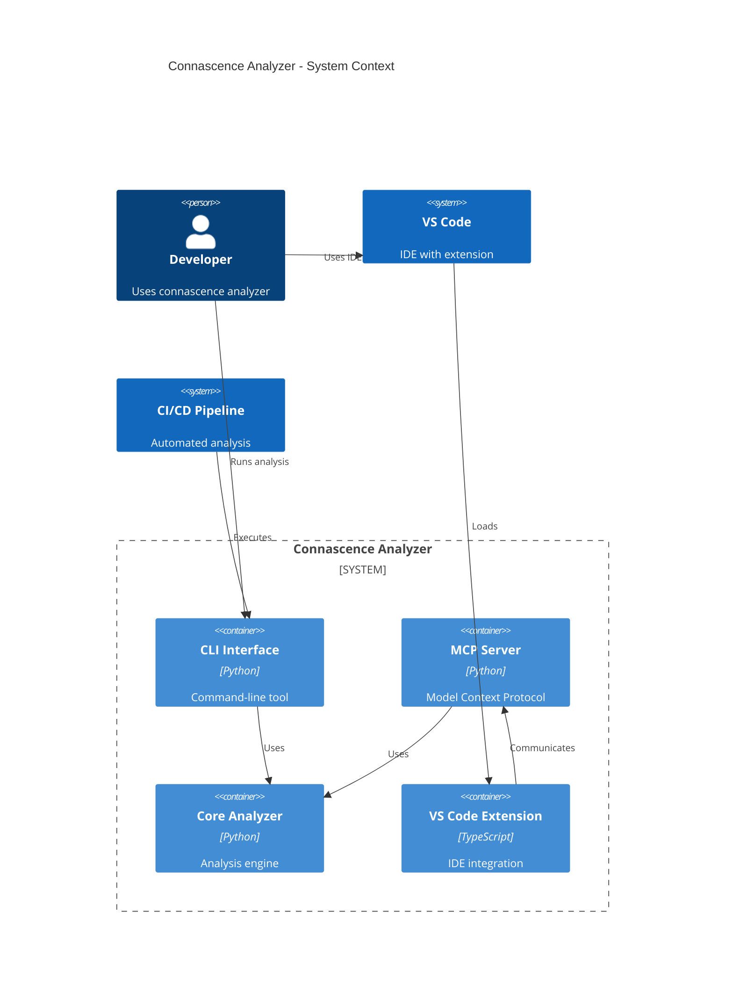

CONNASCENCE ANALYZER - COMPREHENSIVE ARCHITECTURAL ANALYSIS
======================================================================
Generated on: C:\Users\17175\Desktop\connascence

ARCHITECTURAL ASSESSMENT REPORT
========================================

QUALITY METRICS:
----------------
- Total Components: 11
- High Coupling Pairs: 13
- Circular Dependencies: 3
- Architectural Violations: 28

ARCHITECTURAL STRENGTHS:
-------------------------
+ Clear separation of CLI and MCP interfaces
+ Centralized analysis engine in 'analyzer' module
+ Dedicated utility and configuration modules
+ Modular reporting system
+ Experimental features isolated from core

ARCHITECTURAL WEAKNESSES:
--------------------------
- High coupling between analyzer and multiple modules
- Circular dependencies create maintenance challenges
- Policy module tightly coupled to analyzer
- Configuration scattered across modules
- Limited abstraction between layers

OVERALL ARCHITECTURE GRADE: D
Based on coupling, dependencies, and violations analysis.


COMPONENT INTERACTION MATRIX
==================================================

INTERACTION STRENGTH ANALYSIS:
-----------------------------------
      Source |       Target |   Strength | Type
------------------------------------------------------------
       utils |       config |   100.00% | CRITICAL
integrations |       config |    80.00% | CRITICAL
     autofix |         core |    75.00% | CRITICAL
experimental |     analyzer |    70.00% | CRITICAL
      policy |     analyzer |    66.67% | CRITICAL
         cli |     analyzer |    57.14% | CRITICAL
   dashboard |     analyzer |    44.44% | HIGH
         mcp |     analyzer |    43.48% | HIGH
       tests |          cli |    36.59% | HIGH
    analyzer |    reporting |    35.29% | HIGH
      policy |        utils |    33.33% | HIGH
   dashboard |       policy |    33.33% | HIGH
         cli | experimental |    32.14% | HIGH
experimental |    reporting |    30.00% | MEDIUM
       tests |     analyzer |    26.83% | MEDIUM

MODULE RESPONSIBILITY ANALYSIS:
-----------------------------------
    analyzer: Fan-In=66, Fan-Out=17, Instability= 0.20 (STABLE)
     autofix: Fan-In=11, Fan-Out= 8, Instability= 0.42 (BALANCED)
         cli: Fan-In=30, Fan-Out=28, Instability= 0.48 (BALANCED)
      config: Fan-In=10, Fan-Out= 0, Instability= 0.00 (STABLE)
        core: Fan-In=13, Fan-Out= 0, Instability= 0.00 (STABLE)
   dashboard: Fan-In= 2, Fan-Out= 9, Instability= 0.82 (UNSTABLE)
experimental: Fan-In=10, Fan-Out=10, Instability= 0.50 (BALANCED)
         mcp: Fan-In=14, Fan-Out=23, Instability= 0.62 (BALANCED)
      policy: Fan-In=17, Fan-Out= 9, Instability= 0.35 (BALANCED)
   reporting: Fan-In=11, Fan-Out= 0, Instability= 0.00 (STABLE)
       utils: Fan-In= 8, Fan-Out= 1, Instability= 0.11 (STABLE)


DATA FLOW AND COMMUNICATION PATTERNS
=============================================

PRIMARY DATA FLOW PATHS:
-------------------------
1. CLI WORKFLOW:
   User Input → CLI → Analyzer → Reporting → Output
   Coupling: CLI→Analyzer (57.14%)

2. MCP WORKFLOW:
   VS Code → MCP Server → Analyzer → Results → VS Code
   Coupling: MCP→Analyzer (43.48%)

3. ANALYSIS WORKFLOW:
   Source Code → Core Engine → Rules/Policy → Violations → Reporting
   Coupling: Analyzer→Policy (11.76%)

SHARED DATA STRUCTURES:
-------------------------
- ConnascenceViolation: Used across analyzer, mcp, reporting
- Configuration objects: Shared between config, analyzer, cli
- AST representations: Core to analyzer engine
- Results/Reports: Generated by analyzer, consumed by interfaces

COMMUNICATION BOTTLENECKS:
-------------------------
- ANALYZER: 66 incoming dependencies (potential bottleneck)
- CLI: 30 incoming dependencies (potential bottleneck)
- POLICY: 17 incoming dependencies (potential bottleneck)
- MCP: 14 incoming dependencies (potential bottleneck)
- CORE: 13 incoming dependencies (potential bottleneck)


REFACTORING ROADMAP
====================

PHASE 1: CRITICAL ISSUES (Immediate - 1-2 weeks)
--------------------------------------------------
1. Break circular dependencies:
   - analyzer → mcp → analyzer → analyzer
     Solution: Extract interface, use dependency injection
   - analyzer → policy → analyzer → analyzer
     Solution: Extract interface, use dependency injection
   - analyzer → dashboard → analyzer → analyzer
     Solution: Extract interface, use dependency injection

2. Reduce critical coupling (>50%):
   - integrations → config (80.0%)
     Solution: Introduce facade/adapter pattern
   - policy → analyzer (66.7%)
     Solution: Introduce facade/adapter pattern
   - utils → config (100.0%)
     Solution: Introduce facade/adapter pattern

PHASE 2: HIGH PRIORITY (2-4 weeks)
----------------------------------------
1. Refactor analyzer module (high fan-in):
   - Extract core interfaces
   - Implement plugin architecture
   - Reduce direct dependencies

2. Centralize configuration management:
   - Create unified config module
   - Remove config scattering
   - Implement config validation

PHASE 3: MEDIUM PRIORITY (1-2 months)
------------------------------------------
1. Implement proper layering:
   - Define clear architectural layers
   - Enforce dependency direction
   - Add layer validation tests

2. Improve interface consistency:
   - Standardize error handling
   - Unify data structures
   - Document public APIs

PHASE 4: LOW PRIORITY (Long-term)
-----------------------------------
1. Performance optimization:
   - Optimize hot paths
   - Implement caching strategies
   - Profile and tune

2. Enhanced modularity:
   - Plugin system for analyzers
   - Dynamic module loading
   - Improved extensibility


ARCHITECTURE DIAGRAMS
=========================

DEPENDENCY GRAPH:
```mermaid
graph TD
    %% Connascence Analyzer Architecture Dependency Graph

    %% Node Definitions
    analyzer[Analyzer]
    class analyzer coreModule
    autofix[Autofix]
    class autofix featureModule
    cli[CLI]
    class cli interfaceModule
    config[Config]
    core[Core]
    class core coreModule
    dashboard[Dashboard]
    class dashboard featureModule
    experimental[Experimental]
    class experimental featureModule
    integrations[Integrations]
    mcp[MCP]
    class mcp interfaceModule
    policy[Policy]
    reporting[Reporting]
    security[Security]
    class security featureModule
    tests[Tests]
    utils[Utils]
    class utils coreModule

    %% Dependencies
    analyzer ---|3| core
    linkStyle 1 stroke:#feca57,stroke-width:2px
    analyzer ---|6| reporting
    linkStyle 2 stroke:#ff6b6b,stroke-width:3px
    analyzer ---|4| mcp
    linkStyle 3 stroke:#feca57,stroke-width:2px
    analyzer ---|2| policy
    linkStyle 4 stroke:#feca57,stroke-width:2px
    analyzer ---|1| utils
    analyzer ---|1| dashboard
    cli ---|16| analyzer
    linkStyle 7 stroke:#ff6b6b,stroke-width:3px
    cli ---|9| experimental
    linkStyle 8 stroke:#ff6b6b,stroke-width:3px
    cli ---|3| policy
    linkStyle 9 stroke:#feca57,stroke-width:2px
    mcp ---|5| config
    linkStyle 10 stroke:#feca57,stroke-width:2px
    mcp ---|4| core
    linkStyle 11 stroke:#feca57,stroke-width:2px
    mcp ---|4| utils
    linkStyle 12 stroke:#feca57,stroke-width:2px
    mcp ---|10| analyzer
    linkStyle 13 stroke:#ff6b6b,stroke-width:3px
    policy ---|3| utils
    linkStyle 14 stroke:#ff6b6b,stroke-width:3px
    policy ---|6| analyzer
    linkStyle 15 stroke:#ff6b6b,stroke-width:3px
    utils ---|1| config
    linkStyle 16 stroke:#ff6b6b,stroke-width:3px
    integrations ---|4| config
    linkStyle 17 stroke:#ff6b6b,stroke-width:3px
    integrations ---|1| analyzer
    linkStyle 18 stroke:#feca57,stroke-width:2px
    tests ---|8| mcp
    tests ---|22| analyzer
    linkStyle 20 stroke:#feca57,stroke-width:2px
    tests ---|10| autofix
    linkStyle 21 stroke:#feca57,stroke-width:2px
    tests ---|30| cli
    linkStyle 22 stroke:#ff6b6b,stroke-width:3px
    tests ---|9| policy
    linkStyle 23 stroke:#feca57,stroke-width:2px
    tests ---|1| reporting
    tests ---|1| dashboard
    tests ---|1| experimental
    experimental ---|7| analyzer
    linkStyle 27 stroke:#ff6b6b,stroke-width:3px
    experimental ---|3| reporting
    linkStyle 28 stroke:#feca57,stroke-width:2px
    dashboard ---|4| analyzer
    linkStyle 29 stroke:#ff6b6b,stroke-width:3px
    dashboard ---|3| policy
    linkStyle 30 stroke:#ff6b6b,stroke-width:3px
    dashboard ---|1| reporting
    linkStyle 31 stroke:#feca57,stroke-width:2px
    dashboard ---|1| autofix
    linkStyle 32 stroke:#feca57,stroke-width:2px
    autofix ---|2| mcp
    linkStyle 33 stroke:#feca57,stroke-width:2px
    autofix ---|6| core
    linkStyle 34 stroke:#ff6b6b,stroke-width:3px

    %% Styling
    classDef coreModule fill:#e3f2fd,stroke:#1976d2,stroke-width:2px
    classDef interfaceModule fill:#f3e5f5,stroke:#7b1fa2,stroke-width:2px
    classDef featureModule fill:#e8f5e8,stroke:#388e3c,stroke-width:2px
```


SYSTEM CONTEXT DIAGRAM:


