# Data Flow Diagrams

## Overview

This document provides comprehensive data flow diagrams showing how data moves through the Connascence Safety Analyzer system, from input processing through analysis to output generation.

## High-Level System Data Flow

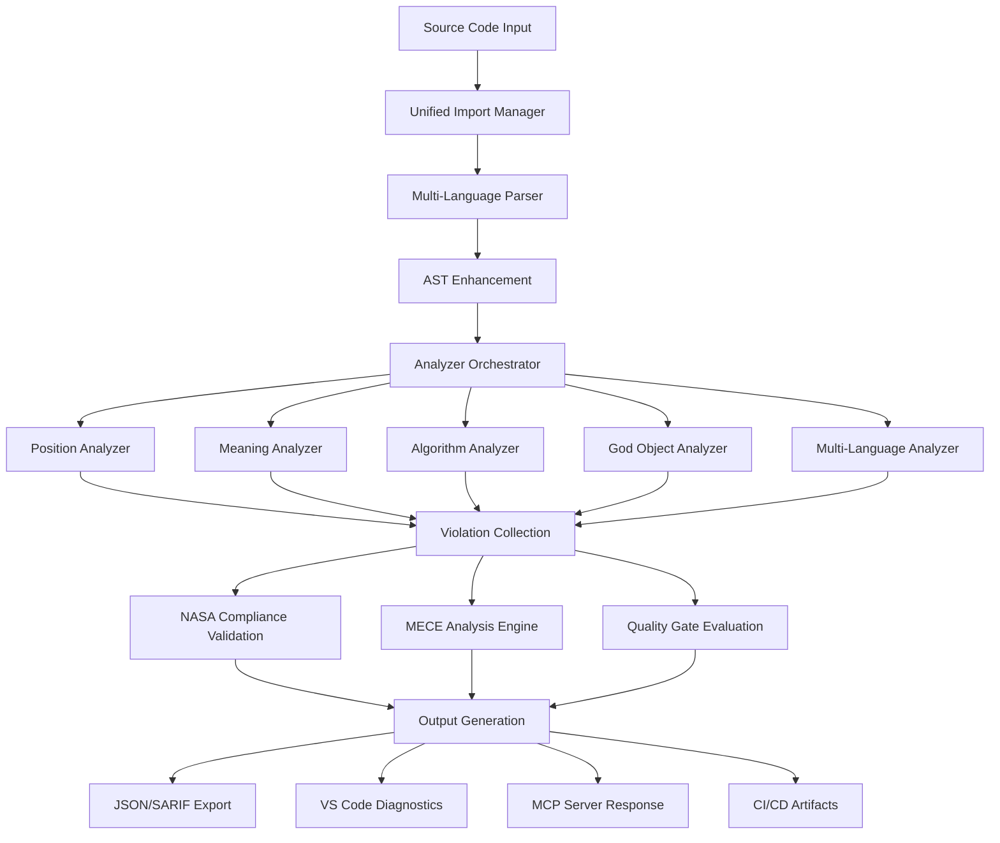

## Component-Level Data Flow

### 1. Input Processing Pipeline

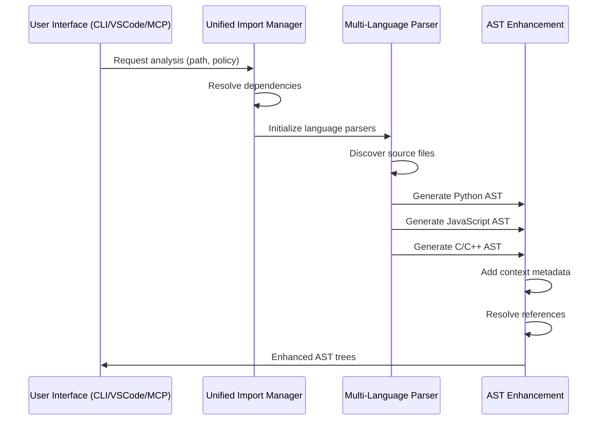

### 2. Analysis Engine Data Flow

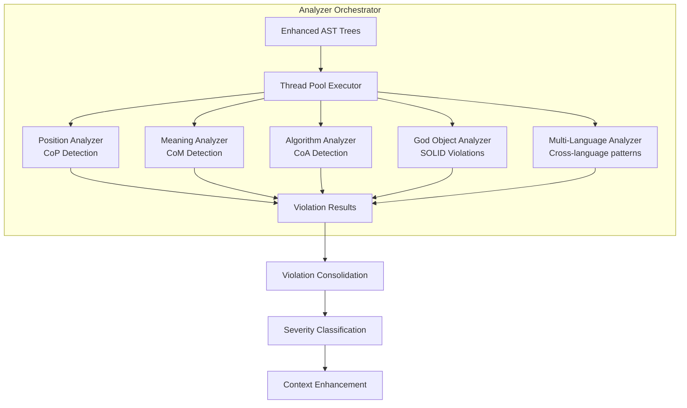

### 3. MECE Analysis Data Flow

```mermaid
stateDiagram-v2
    [*] --> CodeRegistryBuilding: Input: Codebase
    
    state "Phase 1: Code Registry" as CodeRegistryBuilding {
        [*] --> ASTSignatureGeneration
        ASTSignatureGeneration --> FunctionMapping
        FunctionMapping --> ClassMapping
        ClassMapping --> [*]
    }
    
    CodeRegistryBuilding --> ExactDuplicationDetection
    
    state "Phase 2: Exact Duplicates" as ExactDuplicationDetection {
        [*] --> HashComparison
        HashComparison --> ExactMatches
        ExactMatches --> [*]
    }
    
    ExactDuplicationDetection --> SimilarFunctionDetection
    
    state "Phase 3: Similar Functions" as SimilarFunctionDetection {
        [*] --> StructuralAnalysis
        StructuralAnalysis --> SimilarityScoring
        SimilarityScoring --> [*]
    }
    
    SimilarFunctionDetection --> FunctionalOverlapDetection
    
    state "Phase 4: Functional Overlaps" as FunctionalOverlapDetection {
        [*] --> SemanticAnalysis
        SemanticAnalysis --> OverlapIdentification
        OverlapIdentification --> [*]
    }
    
    FunctionalOverlapDetection --> ConsolidationRecommendations
    ConsolidationRecommendations --> MECEOutput: Output: MECE Results
    MECEOutput --> [*]
```

### 4. NASA Compliance Data Flow

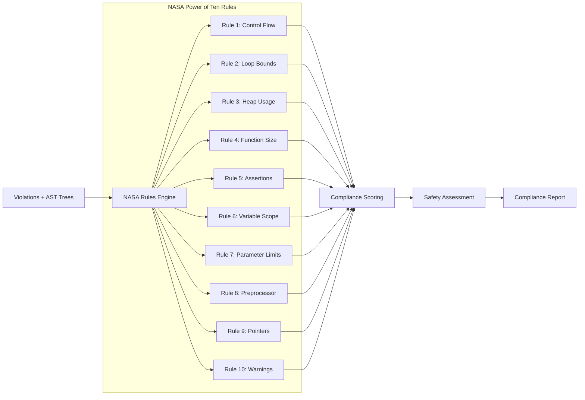

## Interface-Specific Data Flows

### 1. VS Code Extension Data Flow

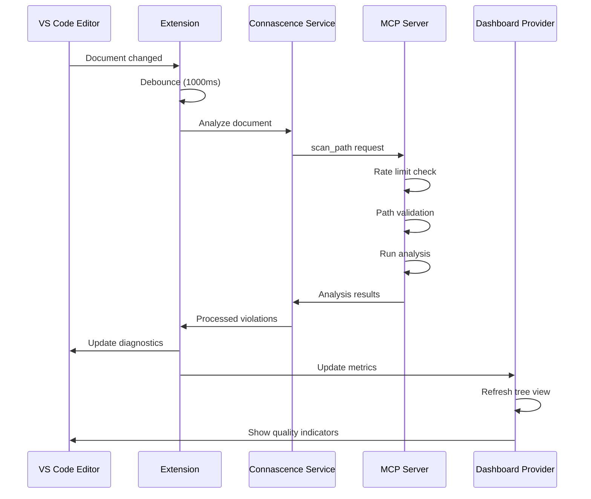

### 2. MCP Server Request/Response Flow

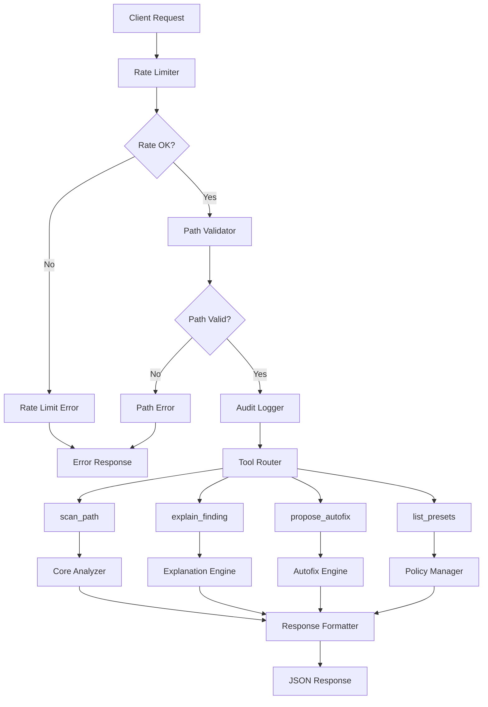

### 3. CLI Analysis Flow

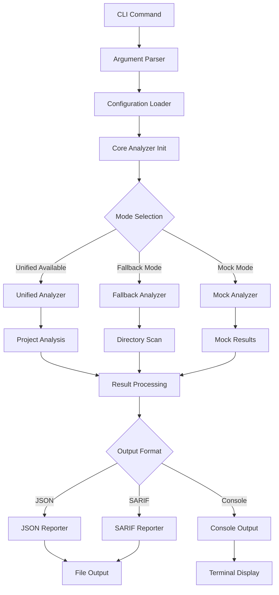

## Data Transformation Stages

### 1. Input Normalization

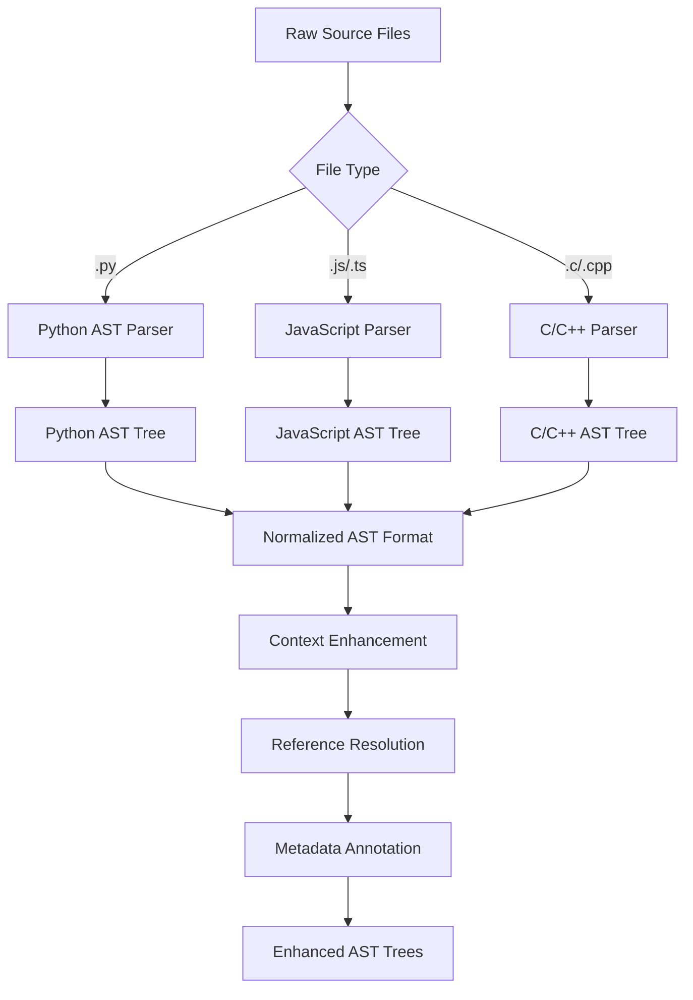

### 2. Violation Processing

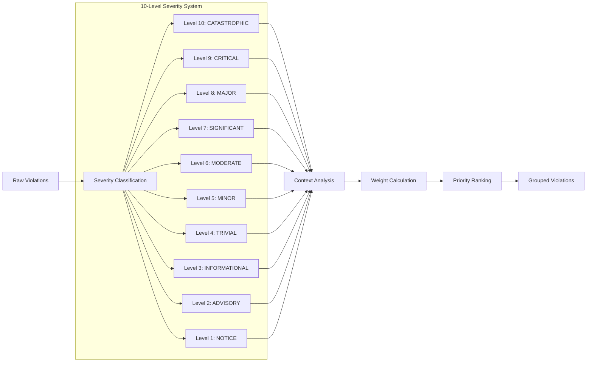

### 3. Output Generation

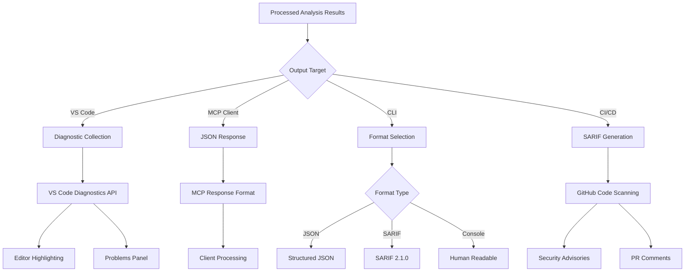

## Performance Optimization Data Flow

### 1. Caching Strategy

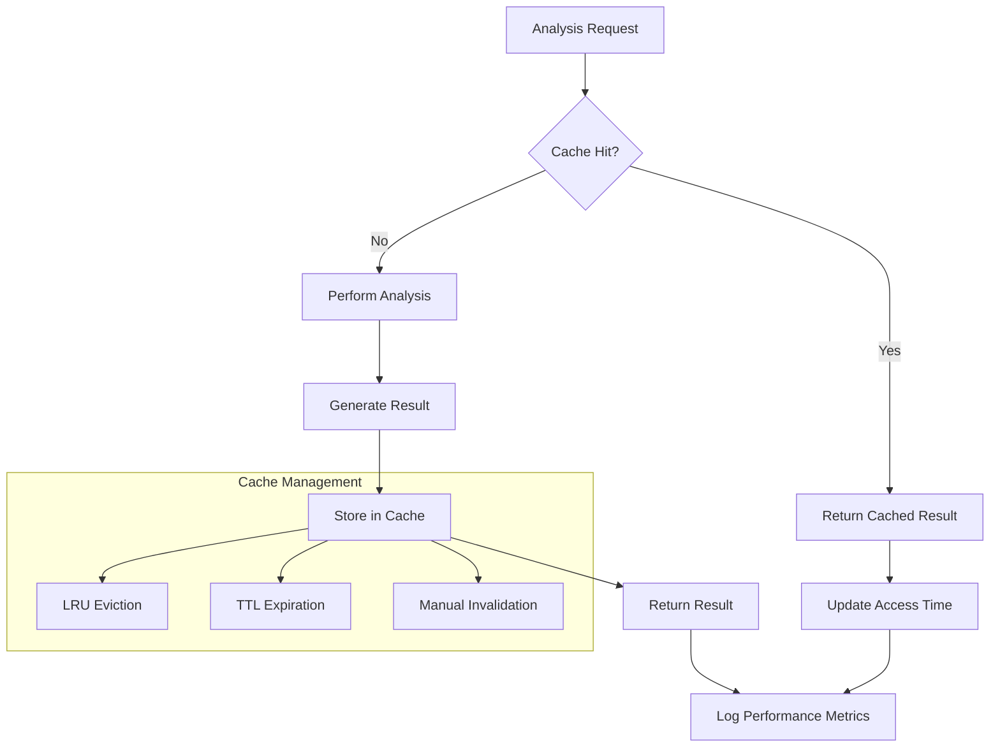

### 2. Parallel Processing Flow

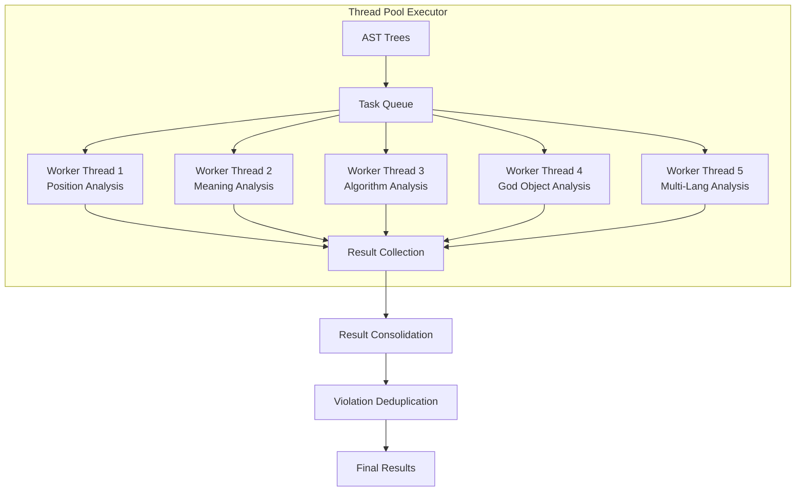

## Error Handling Data Flow

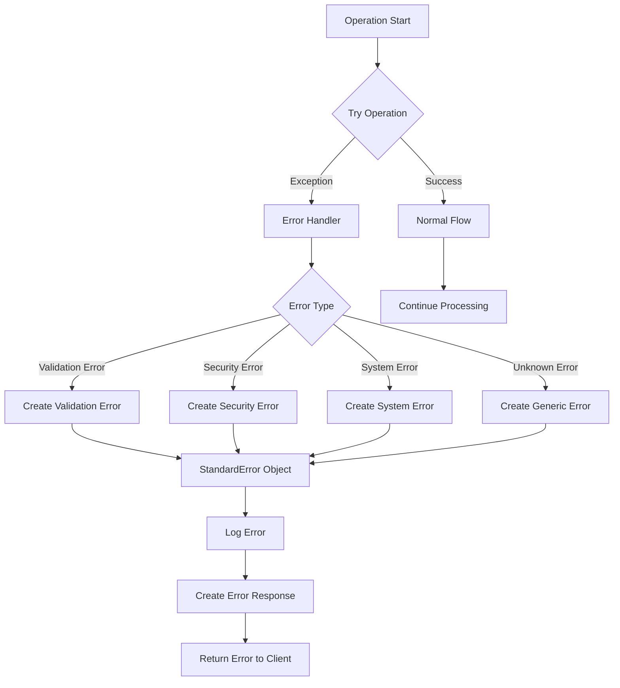

## Real-Time Analysis Data Flow (VS Code)

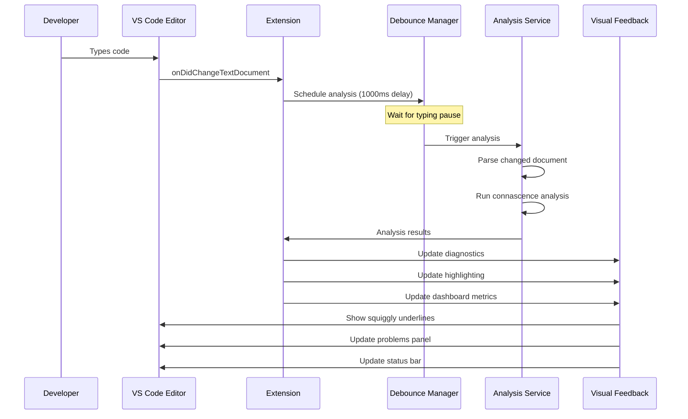

## Batch Processing Data Flow (CI/CD)

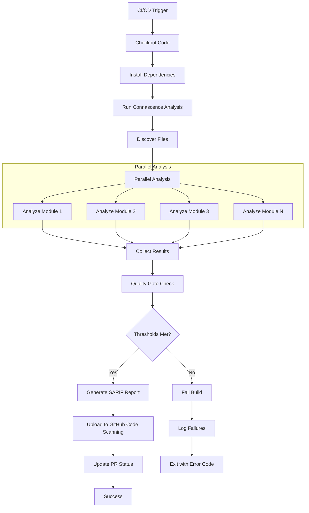

This comprehensive set of data flow diagrams illustrates how data moves through every major component and interface of the Connascence Safety Analyzer system, providing clear visualization of the system's internal workings and integration patterns.