# Integration Architecture Diagram: Connascence Analyzer System

## System Overview

This document provides comprehensive architectural diagrams showing data flows, component relationships, and integration patterns across the connascence analyzer ecosystem.

---

## High-Level System Architecture

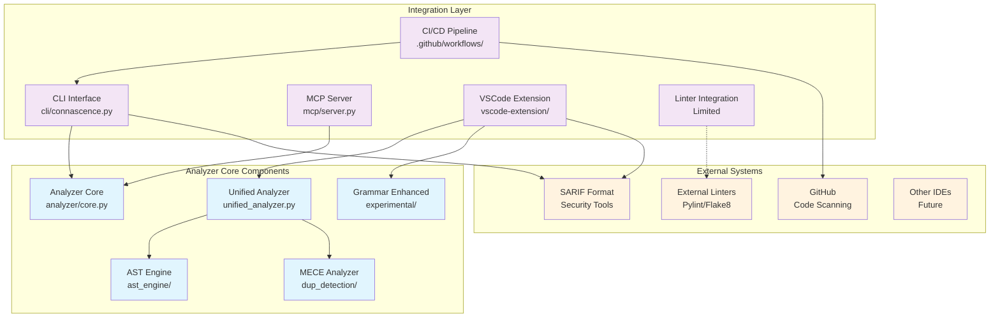

---

## Detailed Data Flow Architecture

### 1. CLI Integration Data Flow

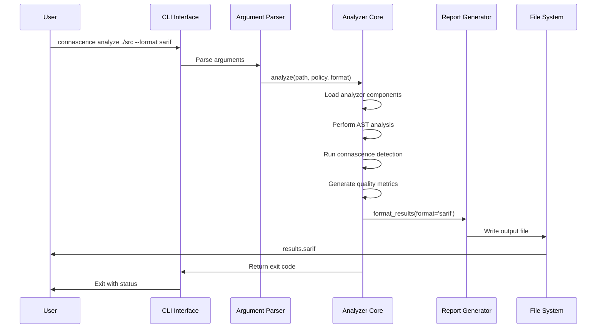

**Data Flow Characteristics**:
- **Synchronous**: Blocking execution until complete
- **Batch Processing**: Analyzes entire directory structure
- **File-based Output**: Results written to file system
- **Exit Code Communication**: Success/failure via process exit codes

### 2. MCP Server Integration Data Flow

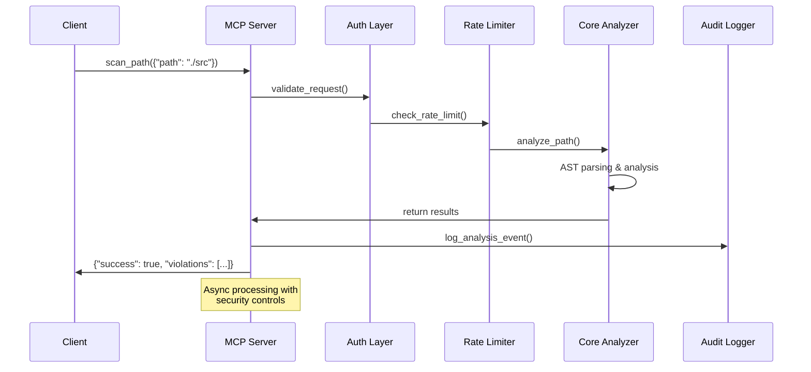

**Data Flow Characteristics**:
- **Asynchronous**: Non-blocking tool execution
- **Security Layer**: Authentication, rate limiting, audit logging
- **Structured Responses**: JSON format with success indicators
- **Real-time Processing**: Individual file/path analysis

### 3. VSCode Extension Data Flow

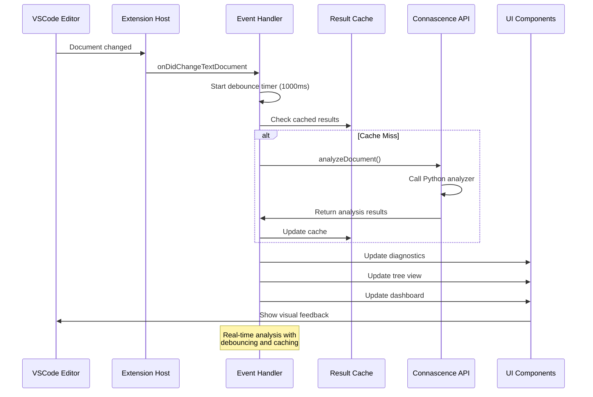

**Data Flow Characteristics**:
- **Event-Driven**: Responds to document changes
- **Debounced Processing**: Prevents excessive analysis during typing
- **Multi-UI Update**: Diagnostics, tree views, dashboards updated simultaneously
- **Caching Layer**: Performance optimization for repeated analysis

### 4. CI/CD Pipeline Data Flow

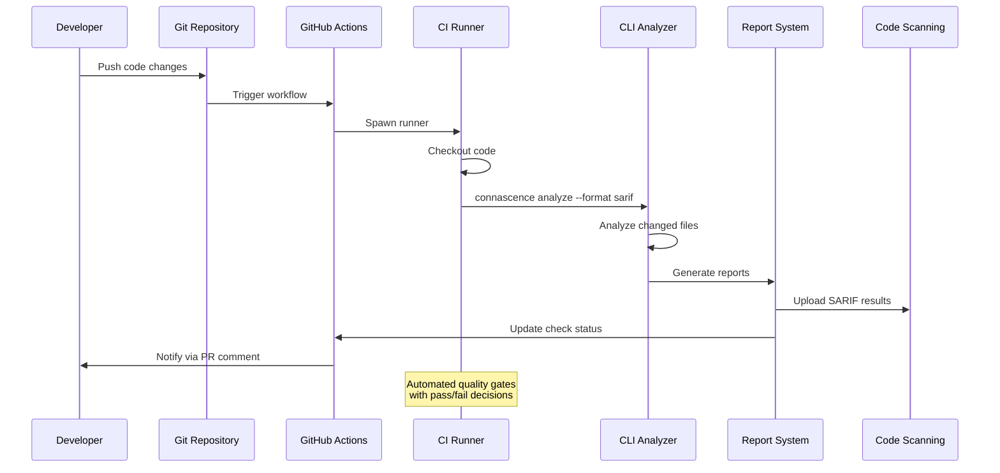

**Data Flow Characteristics**:
- **Pipeline-Driven**: Triggered by git events
- **Automated Quality Gates**: Pass/fail based on thresholds
- **Multi-Format Output**: SARIF for security, JSON for metrics
- **Integration Points**: GitHub Code Scanning, PR comments, status checks

---

## Component Interaction Matrix

### Core Analyzer Component Relationships

```mermaid
graph LR
    subgraph "Core Analysis Engine"
        CORE[Core Analyzer<br/>Entry Point]
        UNIFIED[Unified Analyzer<br/>Phase Coordinator]
        DETECTOR[Connascence Detector<br/>AST Visitor]
    end
    
    subgraph "Specialized Analyzers"
        GOD[God Object Analyzer<br/>ast_engine/]
        MECE[MECE Analyzer<br/>dup_detection/]
        GRAMMAR[Grammar Enhanced<br/>experimental/]
        SMART[Smart Integration<br/>smart_integration_engine.py]
    end
    
    subgraph "Reporting System"
        JSON[JSON Reporter]
        SARIF[SARIF Reporter]
        MARKDOWN[Markdown Reporter]
        DASHBOARD[Dashboard Data]
    end
    
    %% Primary flows
    CORE --> UNIFIED
    UNIFIED --> DETECTOR
    UNIFIED --> GOD
    UNIFIED --> MECE
    UNIFIED --> SMART
    
    %% Advanced flows (VSCode only)
    UNIFIED -.-> GRAMMAR
    GRAMMAR -.-> SMART
    
    %% Output flows
    UNIFIED --> JSON
    UNIFIED --> SARIF
    UNIFIED --> MARKDOWN
    UNIFIED -.-> DASHBOARD
    
    %% Styling
    classDef core fill:#e3f2fd
    classDef specialized fill:#f1f8e9
    classDef reporting fill:#fce4ec
    
    class CORE,UNIFIED,DETECTOR core
    class GOD,MECE,GRAMMAR,SMART specialized  
    class JSON,SARIF,MARKDOWN,DASHBOARD reporting
```

---

## Integration Communication Patterns

### 1. Direct Integration Pattern (CLI)

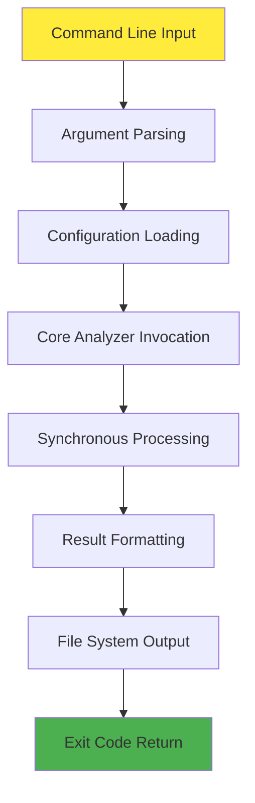

**Characteristics**:
- **Synchronous**: Blocking execution
- **Direct Calls**: No service layer
- **File-based I/O**: Input/output via file system
- **Process Exit Codes**: Success/failure signaling

### 2. Service Integration Pattern (MCP)

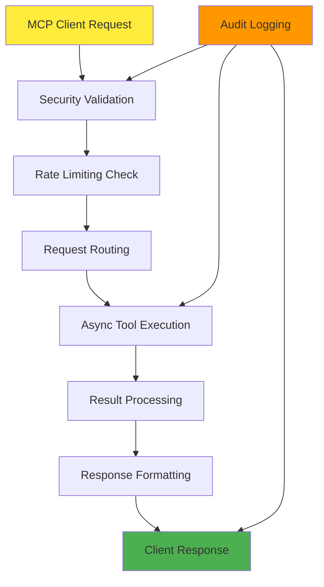

**Characteristics**:
- **Asynchronous**: Non-blocking tool execution
- **Service Layer**: Authentication, rate limiting, audit
- **Structured Communication**: JSON request/response
- **Enterprise Features**: Security, compliance, monitoring

### 3. Event-Driven Pattern (VSCode)

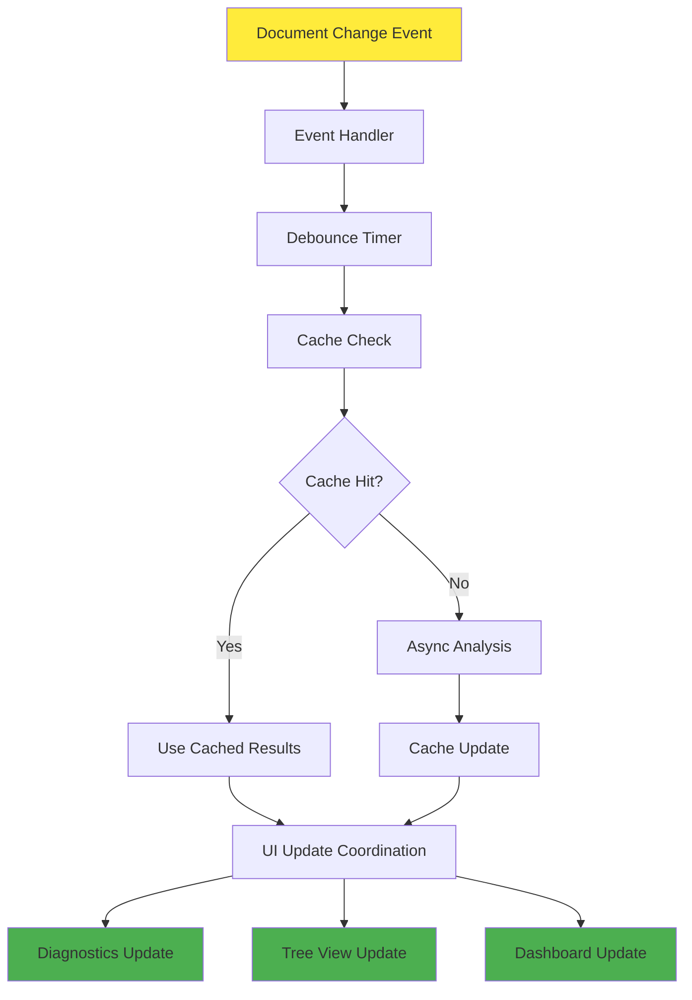

**Characteristics**:
- **Event-Driven**: Responds to document changes
- **Debounced Processing**: Prevents analysis spam
- **Multi-UI Coordination**: Updates multiple UI components
- **Caching Strategy**: Performance optimization

### 4. Pipeline Integration Pattern (CI/CD)

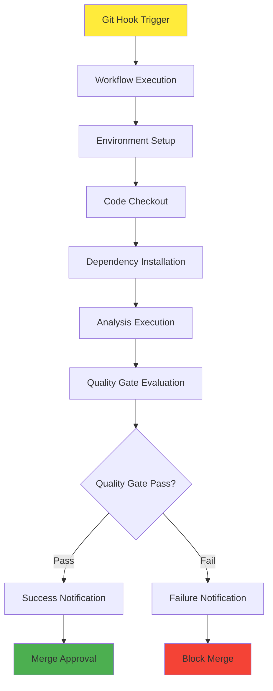

**Characteristics**:
- **Pipeline-Driven**: Triggered by repository events
- **Quality Gates**: Automated pass/fail decisions
- **Environment Isolation**: Fresh environment per execution
- **Integration Points**: GitHub, SARIF, notifications

---

## Data Transformation Flow

### Analysis Result Transformation Pipeline

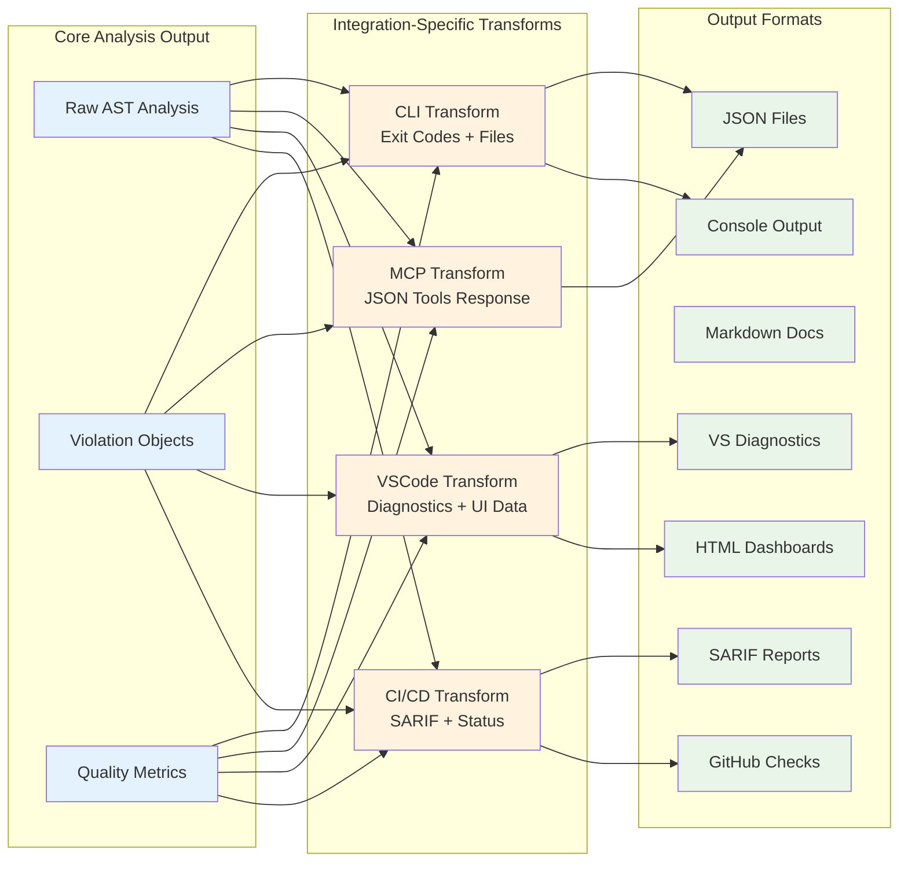

---

## Configuration Management Architecture

### Current Fragmented Configuration System

```mermaid
graph TD
    subgraph "CLI Configuration"
        A1[Command Line Args]
        A2[Environment Variables]
    end
    
    subgraph "VSCode Configuration"
        B1[User Settings]
        B2[Workspace Settings]
        B3[Extension Manifest]
    end
    
    subgraph "MCP Configuration"
        C1[Server Config Files]
        C2[Client Config]
        C3[Tool Parameters]
    end
    
    subgraph "CI/CD Configuration"
        D1[Workflow YAML]
        D2[Repository Settings]
        D3[Environment Secrets]
    end
    
    E[Core Analyzer] 
    
    A1 --> E
    A2 --> E
    B1 --> E
    B2 --> E
    B3 --> E
    C1 --> E
    C2 --> E
    C3 --> E
    D1 --> E
    D2 --> E
    D3 --> E
    
    style E fill:#ff9800
    classDef config fill:#f3e5f5
    class A1,A2,B1,B2,B3,C1,C2,C3,D1,D2,D3 config
```

**Problems with Current Architecture**:
- **No Configuration Synchronization**: Changes in one integration don't propagate
- **Inconsistent Schema**: Different configuration formats across integrations
- **Policy Name Conflicts**: Same functionality, different names
- **No Validation**: Invalid configurations discovered at runtime

### Proposed Unified Configuration Architecture

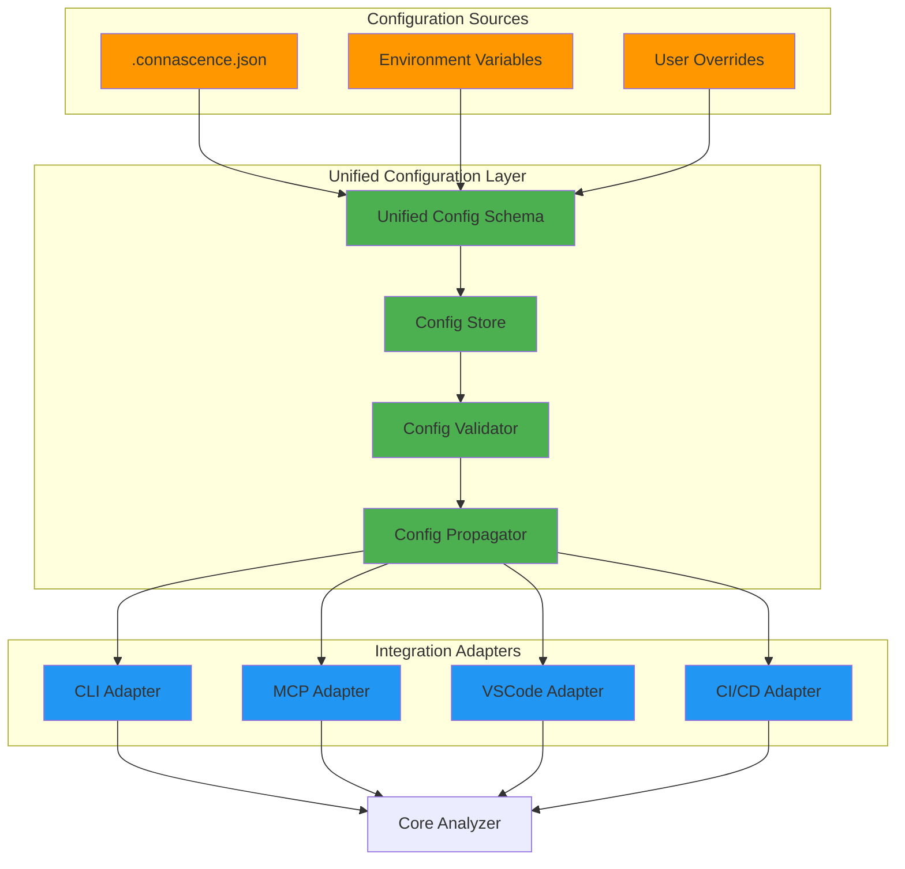

---

## Security and Audit Flow

### MCP Server Security Architecture

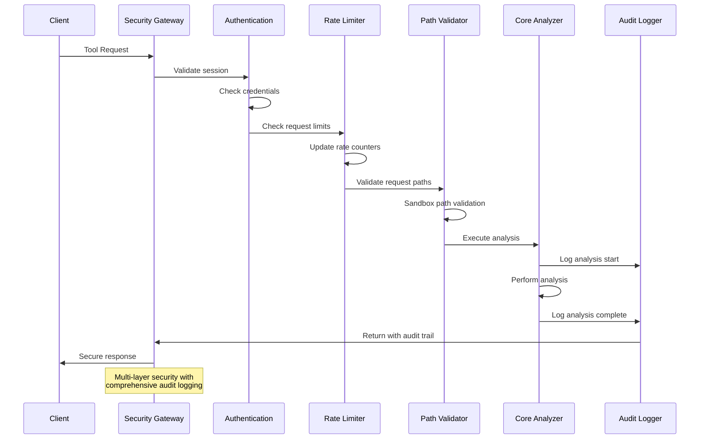

---

## Performance and Scalability Architecture

### Parallel Processing Patterns

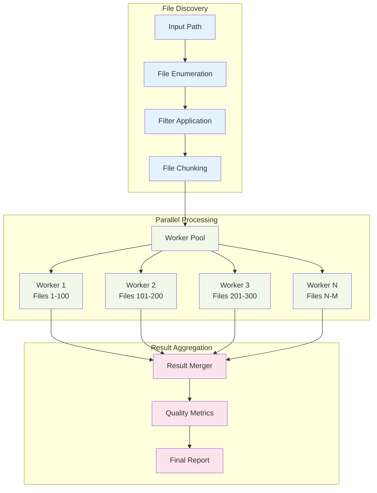

---

## Integration Maturity Assessment

### Feature Implementation Maturity by Integration

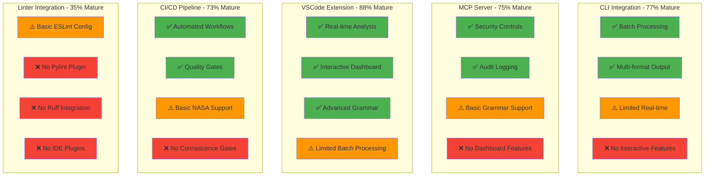

---

## Recommended Target Architecture

### Unified Integration Framework

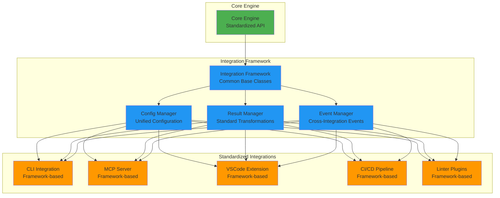

This target architecture would provide:
- **Unified Configuration Management**: Single source of truth for settings
- **Standardized Integration API**: Common interface for all integrations
- **Cross-Integration Events**: Coordination between different integration points
- **Framework-based Development**: Reduced code duplication and consistent patterns
- **Plugin Architecture**: Easy addition of new integrations

---

## Implementation Timeline

### Phase 1: Foundation (90 days)
- Unified configuration schema
- Standard integration base classes
- Policy name standardization

### Phase 2: Feature Parity (180 days)
- Add missing features to each integration
- Implement cross-integration testing
- Create migration tools

### Phase 3: Advanced Architecture (365 days)
- Plugin framework implementation
- Advanced cross-integration coordination
- Performance optimization and scalability

This architectural analysis provides the roadmap for evolving the connascence analyzer from a collection of independent integrations into a cohesive, enterprise-ready analysis platform.